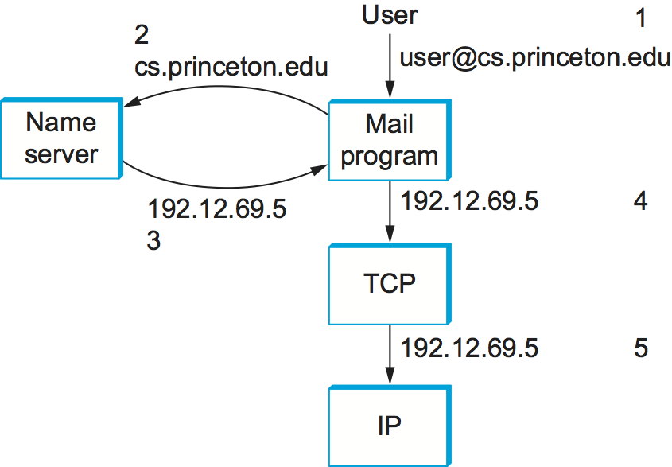
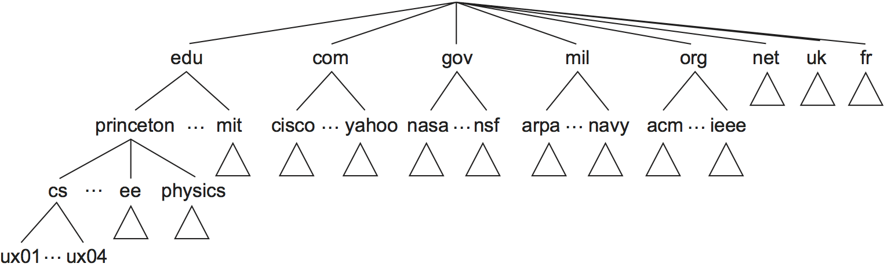
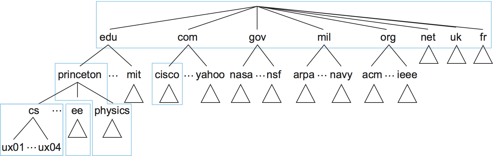
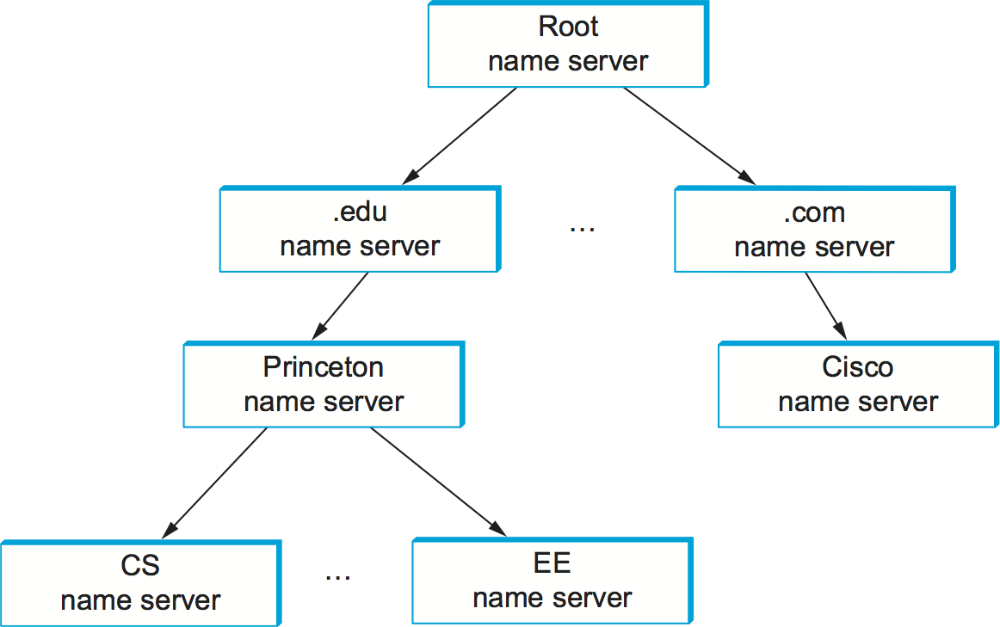

# {{Paj.Toe}}

有一些协议对于互联网的顺利运行是必不可少的,但是它们并不适合严格的分层模型. 其中之一是域名系统 (DNS) ℴℴ不是用户通常显式调用的应用程序,而是几乎所有其他应用程序都依赖的服务. 这是因为名称服务用于将主机名转换为主机地址;此类应用程序的存在允许其他应用程序的用户通过名称而不是地址来引用远程主机. 换句话说,名称服务通常由其他应用程序使用,而不是由人使用. 

第二个关键功能是网络管理,虽然普通用户并不熟悉,但是系统管理员最常执行的操作是网络管理. 网络管理被广泛认为是网络化的难题之一,一直是众多研究的热点. 下面我们将讨论一些问题和解决问题的方法. 

## 名称服务 (DNS) 

在本书的大部分内容中,我们一直在使用地址来识别主机. 虽然完全适合路由器处理,但地址并不完全是用户友好的. 正因为这个原因,一个独特的*名称*也通常被分配给网络中的每个主机. 在本节中,我们已经看到了像http这样的应用协议. `www.princeton.edu`. 现在我们描述如何开发命名服务,以将用户友好的名称映射到路由器友好的地址. 名称服务有时被称为*中间件*因为它们填补了应用程序和底层网络之间的空白. 

主机名称与主机地址不同,有两个重要的方式. 首先,它们通常是可变长度和助记符,从而使它们更容易让人记住.  (相比之下,固定长度的数字地址更易于路由器处理. ) 第二,名称通常不包含帮助网络定位 (向主机路由数据包) 的信息. 相反,地址有时包含嵌入其中的路由信息;*平的*地址 (不可分割为组成部分) 是例外. 

在深入讨论主机如何在网络中命名之前,我们首先介绍一些基本术语. 首先,A*名称空间*定义可能的名称集. 名称空间可以是*平的* (名称不可分割为组件) 或*分级的* (UNIX文件名是一个明显的例子) . 第二,命名系统维护一个集合*绑定*名称的值. 该值可以是任何我们希望命名系统返回时的名称,在许多情况下,它是一个地址. 最后,A*归结机制*是一个过程,当用名称调用时,返回相应的值. 一*名称服务器*是解析机制的特定实现,该解析机制在网络上可用,并且可以通过发送消息对其进行查询. 

由于它的大尺寸,互联网有一个特别发达的命名系统域名系统 (DNS) . 因此,我们使用DNS作为讨论主机命名问题的框架. 请注意,Internet并不总是使用DNS. 在其早期的历史上,当只有几百个在互联网上的主机时,一个称为*网络信息中心* (NIC) 维护一个名为地址绑定的平面表;该表被调用. 每当站点想要向Internet添加新主机时,站点管理员就向NIC发送电子邮件,给出新主机的名称/地址对. 该信息被手动输入到表中,修改后的表每隔几天被发送到各个站点,每个站点的系统管理员将表安装在站点的每个主机上. 然后通过查找表本地副本中的主机名并返回相应地址的过程来实现名称解析. 

毫无疑问,随着互联网上主机数量的增加,命名方法并不奏效. 因此,在80年代中期,域名命名系统正式实施. DNS使用分层命名空间而不是平面名称空间,实现该名称空间的绑定的"表"被划分为不相交的片段,并在整个Internet上分发. 这些子表可以在可以通过网络查询的名称服务器中使用. 

在Internet中发生的情况是,用户向应用程序呈现主机名 (可能嵌入在诸如电子邮件地址或URL的复合名称中) ,并且该程序参与命名系统以将该名称转换为主机地址. 然后,应用程序通过呈现带有主机IP地址的一些传输协议 (例如,TCP) 来打开到该主机的连接. 这种情况说明 (在发送电子邮件的情况下) . [图1](#names). 虽然这张图片让名字解析任务看起来很简单,但是我们会看到更多的内容. 

<figure class="line">
	<a id="names"></a>
	
	<figcaption>Names translated into addresses, where the numbers 1
	to 5 show the sequence of steps in the process.</figcaption>
</figure>

### 领域层次

DNS为Internet对象实现分层名称空间. 与Unix文件名不同,使用斜杠分隔的命名组件从左到右进行处理,DNS名称从右到左进行处理,并使用句点作为分隔符.  (虽然它们是从右向左处理的,但是人类仍然从左向右读取域名. ) 主机的示例域名是`cicada.cs.princeton.edu`. 请注意,我们说过域名是用来命名互联网的"对象". 我们的意思是,DNS并不严格用于将主机名映射到主机地址. 更确切地说,DNS将域名映射为值. 目前,我们假设这些值是IP地址;我们将在本节后面回到这个问题. 

<figure class="line">
	<a id="domains"></a>
	
	<figcaption>Example of a domain hierarchy.</figcaption>
</figure>

与Unix文件层次结构类似,DNS层次结构可以可视化为树,其中树中的每个节点对应于域,树中的叶子对应于命名的主机. [图2](#domains)给出域层次结构的示例. 注意,我们不应该给术语分配任何语义. *领域*除此之外,它只是一个可以附加名称的上下文. 

> 令人困惑的词*领域*也被用于因特网路由,在这里它意味着与DNS不同的东西,大致等同于术语. *自治系统*.

实际上,当域名层次结构首次被开发时,关于在层次结构的顶部附近分发的名称将由什么约定来管理,进行了大量的讨论. 在没有详细讨论的情况下,注意层次结构在第一层不是很宽. 每个国家都有域名,再加上"六大"域名: `.edu`,`.com`,`.gov`,`.mil`,`.org`和`.net`. 这六个域都最初设在美国 (因特网和DNS是在美国发明的) ;例如,只有美国认可的教育机构才能注册域名. 近年来,顶级域名的数量不断扩大,部分是为了应对域名的高需求. 较新的顶级域包括`.biz`,`.coop`和`.info`. 另一个最近的发展是支持以拉丁字母表以外的字符集表示的域名,如阿拉伯语和中文. 

### 名称服务器

完整的域名层次结构只存在于抽象中. 现在我们把注意力放在如何实现这个层次结构的问题上. 第一步是将层次划分为子树,称为子树. *地带*.[图3](#zones)显示给定的层次结构. [图2](#domains)可以分为区域. 可以将每个区域看作与负责该层次结构的某个管理权限相对应. 例如,层次结构的顶层形成一个区域,该区域由互联网名称和数字分配公司 (ICANN) 管理. 下面是一个与普林斯顿大学相对应的区域. 在这个区域内,一些部门不想承担管理层次结构的责任 (因此他们留在大学级别区域) ,而另一些部门,如计算机科学系,则管理他们自己的部门级别区域. 

<figure class="line">
	<a id="zones"></a>
	
	<figcaption>Domain hierarchy partitioned into zones.</figcaption>
</figure>

区域的相关性是它对应于DNS名称服务器中的基本实现单元. 具体地说,包含在每个区域中的信息在两个或多个名称服务器中实现. 每个名称服务器,反过来,是一个程序,可以在互联网上访问. 客户端向名称服务器发送查询,名称服务器响应请求的信息. 有时响应包含客户端想要的最终答案,有时响应包含指向客户端接下来应该查询的另一个服务器的指针. 因此,从实现的角度来看,将DNS看作由名称服务器的层次结构而不是由域的层次结构来表示更为准确,如下所示[图4](#servers).

<figure class="line">
	<a id="servers"></a>
	
	<figcaption>Hierarchy of name servers.</figcaption>
</figure>

注意,为了冗余起见,每个区域在两个或多个名称服务器中实现;也就是说,即使一个名称服务器失败,信息仍然可用. 另一方面,给定的名称服务器可以自由地执行多个区域. 

每个名称服务器实现区域信息作为集合. *资源记录*. 本质上,资源记录是一个名称到值绑定,或者更确切地说,包含以下字段的5元组: 

```pseudo
(Name, Value, Type, Class, TTL)
```

这个`Name`和`Value`领域正是你所期望的,而`Type`字段指定如何`Value`应予以解释. 例如,指示`Value`是一个IP地址. 因此,`A`记录实现我们所假设的映射地址. 其他记录类型包括: 

-   `NS`-`Value`字段给出正在运行名称服务器的主机的域名,该名称服务器知道如何解析指定域内的名称. 

-   `CNAME`-`Value`字段给出特定主机的规范名称;它用于定义别名. 

-   `MX`-`Value`字段提供运行邮件服务器的主机的域名,该邮件服务器接受指定域的消息. 

这个`Class`字段包括允许NIC以外的实体定义有用的记录类型. 迄今为止,唯一广泛使用的`Class`是互联网所使用的;它是指`IN`. 最后,活的时间 (`TTL`字段显示该资源记录有效多长时间. 它被服务器用来缓存来自其他服务器的资源记录;当`TTL`到期后,服务器必须从其缓存中删除记录. 

为了更好地理解资源记录如何表示域层次结构中的信息,考虑以下示例[图2](#domains). 为了简化示例,我们忽略了`TTL`字段中,我们只为实现每个区域的名称服务器中的一个提供相关信息. 

首先,根名称服务器包含`NS`为每个顶级域 (TLD) 名称服务器记录. 这标识了一个服务器,可以解析DNS层次结构的这一部分的查询 (`.edu`和`.com`在这个例子中) . 它也有`A`将这些名称转换成相应IP地址的记录. 总而言之,这两个记录有效地实现了从根名称服务器到TLD服务器之一的指针. 

```pseudo
(edu, a3.nstld.com, NS, IN)
(a3.nstld.com, 192.5.6.32, A, IN)
(com, a.gtld-servers.net, NS, IN)
(a.gtld-servers.net, 192.5.6.30, A, IN)
...
```

在层次结构上移动一级,服务器有这样的域的记录: 

```pseudo
(princeton.edu, dns.princeton.edu, NS, IN)
(dns.princeton.edu, 128.112.129.15, A, IN)
...
```

在这种情况下,我们得到了一个`NS`记录和一个`A`记录负责服务器的名称服务器`princeton.edu`层次结构的一部分. 该服务器可能能够直接解析某些查询 (例如`email.princeton.edu`当它将其他人重定向到层次结构中的另一层的服务器时 (例如,查询) . `penguins.cs.princeton.edu`) 

```pseudo
(email.princeton.edu, 128.112.198.35, A, IN)
(penguins.cs.princeton.edu, dns1.cs.princeton.edu, NS, IN)
(dns1.cs.princeton.edu, 128.112.136.10, A, IN)
...
```

最后,一个第三级名称服务器,例如由域管理的名称服务器`cs.princeton.edu`包含`A`所有主机的记录. 它还可以定义一组别名 (`CNAME`记录这些主机的每一个. 别名有时只是机器的方便 (例如,更短) 名称,但是它们也可以用于提供间接级别. 例如,`www.cs.princeton.edu`是主机名的别名`coreweb.cs.princeton.edu`这允许站点的web服务器移动到另一台机器而不影响远程用户;他们只是继续使用别名,而不考虑当前运行域web服务器的机器. 邮件交换 (邮件交换) `MX`记录为电子邮件应用服务相同的目的-它们允许管理员改变哪个主机代表域接收邮件而不必改变每个人的电子邮件地址. 

```pseudo
(penguins.cs.princeton.edu, 128.112.155.166, A, IN)
(www.cs.princeton.edu, coreweb.cs.princeton.edu, CNAME, IN)
coreweb.cs.princeton.edu, 128.112.136.35, A, IN)
(cs.princeton.edu, mail.cs.princeton.edu, MX, IN)
(mail.cs.princeton.edu, 128.112.136.72, A, IN)
...
```

注意,尽管资源记录实际上可以为任何类型的对象定义,但是DNS通常用于命名主机 (包括服务器) 和站点. 它不用于命名个人或其他对象,如文件或目录;其他命名系统通常用于标识此类对象. 例如,X.500是一个ISO命名系统,旨在使人们更容易识别. 它允许你通过给出一组属性来命名一个人: 姓名ㄡ头衔ㄡ电话号码ㄡ邮政地址等等. 事实证明,X.500过于繁琐,在某种意义上,它被现在在Web上可用的强大搜索引擎所篡夺,但是它最终演变成了轻量级目录访问协议 (LDAP) . LDAP是X.500最初设计为PC前端到X.500的子集. 如今,它越来越受欢迎,主要是在企业层面,作为一种学习用户信息的系统. 

### 名称解析

考虑到名称服务器的层次结构,我们现在考虑客户端如何参与这些服务器来解析域名的问题. 为了说明基本思想,假设客户机希望解析与前一小节给出的服务器集相关的名称. 客户机可以首先向根服务器之一发送包含这个名称的查询 (如下面我们将看到的,这在实践中很少发生,但是现在足以说明基本的操作) . 根服务器不能匹配整个名称,返回它具有的最佳匹配. `NS`记录`edu`指向TLD服务器`a3.nstld.com`. 服务器还返回与此记录相关的所有记录,在这种情况下,`A`记录`a3.nstld.com`. 客户端在未收到应答后,在IP主机上向名称服务器发送相同的查询. `192.5.6.32`. 此服务器也不能匹配整个名称,因此返回`NS`及对应`A`记录`princeton.edu`领域. 再次,客户端在IP主机上向服务器发送与以前相同的查询. `128.112.129.15`这一次又回来了`NS`记录与对应`A`记录`cs.princeton.edu`领域. 这一次,已经能够完全解决查询的服务器已经达到. 对服务器的最终查询`128.112.136.10`收益率`A`记录`penguins.cs.princeton.edu`并且客户端知道相应的IP地址是`128.112.155.166`.

这个例子仍然留下了一些关于解决过程的问题. 第一个问题是客户机首先如何定位根服务器,或者换言之,如何解析知道如何解析名称的服务器的名称?这是任何命名系统中的一个基本问题,答案是系统必须以某种方式被引导. 在这种情况下,一个或多个根服务器的名称到地址映射是众所周知的;也就是说,它是通过命名系统本身之外的某种方式发布的. 

然而,实际上,并非所有客户端都知道根服务器. 相反,在每个Internet主机上运行的客户端程序用*地方的*名称服务器. 例如,普林斯顿计算机科学系的所有主机都知道服务器是如何运行的. `dns1.cs.princeton.edu`. 该本地名称服务器又具有一个或多个根服务器的资源记录,例如: 

```pseudo
('root', a.root-servers.net, NS, IN)
(a.root-servers.net, 198.41.0.4, A, IN)
```

因此,解析名称实际上涉及查询本地服务器的客户端,而本地服务器又充当代表原始客户机查询远程服务器的客户端. 这导致了客户机/服务器交互在[图5](#resolution). 此模型的一个优点是,Internet中的所有主机不必保持当前根服务器所在位置的最新;只有服务器必须知道根. 第二个优点是本地服务器可以查看所有本地客户端发布的查询返回的答案. 本地服务器*高速缓存*这些响应,有时可以解决未来的查询,而不必走出网络. 这个`TTL`远程服务器返回的资源记录中的字段指示每条记录可以安全缓存多长时间. 该缓存机制还可以进一步使用层次结构,减少根和TLD服务器上的负载. 

第二个问题是当用户提交部分名称时,系统是如何工作的 (例如,`penguins`) 而不是完整的域名 (例如,`penguins.cs.princeton.edu`) 答案是客户端程序配置有主机驻留的本地域 (例如,`cs.princeton.edu`) ,它在发送查询之前将该字符串追加到任何简单的名称. 

<figure class="line">
	<a id="resolution"></a>
	
	<figcaption>Name resolution in practice, where the numbers 1 to 10
	show the sequence of steps in the process.</figcaption>
</figure>

为了确保我们是清楚的,我们现在已经看到了三个不同级别的标识符ℴℴ域名ㄡIP地址和物理网络地址ℴℴ并且一个级别的标识符到另一个级别的标识符的映射发生在网络体系结构的不同点. 首先,用户在与应用程序交互时指定域名. 其次,应用程序使用DNS将此名称转换为IP地址;它是放置在每个数据报中的IP地址,而不是域名.  (顺便说一下,这个转换过程涉及通过因特网发送IP数据报,但是这些数据报是发给运行名称服务器的主机的,而不是发给最终目的地的. ) 第三,IP在每个路由器上进行转发,这通常意味着它把一个IP地址映射到另一个IP地址;T是,它将最终目的地的地址映射到下一跳路由器的地址. 最后,IP使用地址解析协议 (ARP) 将下一跳IP地址转换为该机器的物理地址;下一跳可能是最终目的地或者可能是中间路由器. 通过物理网络发送的帧在它们的头中具有这些物理地址. 

## 网络管理 (SNMP) 

网络是一个复杂的系统,无论从涉及的节点数量还是从可以在任意一个节点上运行的协议组来说. 即使您限制自己担心单个管理域内的节点,例如校园,也可能有几十个路由器和数百甚至数千个主机要跟踪. 如果考虑在这些节点中的任何一个上维护和操作的所有状态ℴℴ地址转换表ㄡ路由表ㄡTCP连接状态等等ℴℴ那么很容易对必须管理所有这些信息的前景感到沮丧. 

很容易想象,希望了解不同节点上各种协议的状态. 例如,您可能希望监视已经中止的IP数据报重新组装的数量,以确定是否需要调整垃圾收集部分组装的数据报的超时. 作为另一个示例,您可能希望跟踪各个节点上的负载 (即,发送或接收的数据包的数量) ,以便确定是否需要向网络中添加新的路由器或链路. 当然,你也必须注意硬件和行为不当的软件的证据. 

我们刚才描述的是网络管理的问题,这是贯穿整个网络体系结构的问题. 由于我们想要跟踪的节点是分布式的,所以我们唯一的真正选择是使用网络来管理网络. 这意味着我们需要一种协议,它允许我们在不同的网络节点上读取,并可能写入各种状态信息. 用于此目的的最广泛使用的协议是简单网络管理协议 (SNMP) . 

SNMP本质上是一种支持两种请求消息的专用请求/应答协议: `GET`和`SET`. 前者用于从某个节点检索一段状态,后者用于在某个节点中存储一段新的状态.  (SNMP还支持第三种操作,下面我们将对此进行解释) `GET`操作,因为它是最常用的一种. 

SNMP以明显的方式被使用. 系统管理员与显示关于网络的信息的客户端程序交互. 这个客户端程序通常有一个图形界面. 您可以认为该接口与Web浏览器具有相同的作用. 每当管理员选择他或她希望看到的特定信息片段时,客户端程序使用SNMP从所讨论的节点请求该信息.  (SNMP运行在UDP之上. ) 在该节点上运行的SNMP服务器接收请求,定位适当的信息片段,并将其返回到客户端程序,然后客户端程序将其显示给用户. 

这个否则简单的场景只有一个复杂性: 客户机如何确切地指示它想要检索哪条信息,同样,服务器如何知道要读取内存中的哪个变量以满足请求?答案是SNMP依赖于一个称为*管理信息库* (MIB) . MIB定义了MIB的特定信息片段. *变量*-您可以从网络节点检索. 

MIB的当前版本,称为MIB II,将变量组织成10个不同的*组*. 您将认识到,大多数组对应于本书中描述的协议之一,并且为每个组定义的几乎所有变量都应该看起来很熟悉. 例如: 

-   系统-整个系统 (节点) 的一般参数,包括节点所在的位置ㄡ上升多长时间以及系统名称

-   接口-关于连接到该节点的所有网络接口(适配器)的信息,例如每个接口的物理地址以及在每个接口上发送和接收了多少包

-   地址转换-关于地址解析协议的信息,特别是地址转换表的内容

-   IP-与IP相关的变量,包括路由表ㄡ成功转发了多少数据报,以及关于数据报重组的统计数据;包括由于某种原因IP丢弃数据报的次数

-   TCP-关于TCP连接的信息,例如被动和主动打开的数量ㄡ重置的数量ㄡ超时的次数ㄡ默认的超时设置等;每个连接信息只在连接存在时才持久

-   UDP信息关于UDP流量,包括已发送和接收的UDP数据报的总数. 

还存在用于因特网控制消息协议 (ICMP) ㄡ外部网关协议 (EGP) 和SNMP本身的组. 第十组使用不同的媒体. 

回到客户机确切地说明它希望从节点检索什么信息的问题,拥有一个MIB变量列表只是问题的一半. 还有两个问题. 首先,我们需要一个精确的客户端语法来说明它想要获取的MIB变量中的哪一个. 第二,我们需要对服务器返回的值进行精确的表示. 这两个问题都是用抽象语法表示法 (ASN. 1) 来解决的. 

先考虑第二个问题. 正如我们在前一章中已经看到的,ASN.1/Basic编码规则 (BER) 定义了不同数据类型 (如整数) 的表示. MIB定义每个变量的类型,然后在通过网络传输时使用ASN.1/BER来编码该变量中包含的值. 就第一个问题而言,ASN 1还定义了一个对象识别方案. MIB使用这个标识系统为每个MIB变量分配全局唯一标识符. 这些标识符以"点"符号给出,与域名不同. 例如,1.3.61.2.1.4.3是与IP相关的MIB变量的唯一ASN 1标识符. `ipInReceives`该变量对由该节点接收的IP数据报的数量进行计数. 在这个示例中,1.3.6.1.2.1前缀标识MIB数据库 (记住,ASN.1对象ID用于世界上所有可能的对象) ,4对应于IP组,并且最后3表示该组中的第三个变量. 

因此,网络管理工作如下. SNMP客户端将其想要进入请求消息的MIB变量的ASN.1标识符放入请求消息中,并将此消息发送到服务器. 然后,服务器将该标识符映射到本地变量 (即,映射到存储该变量值的内存位置) ,检索该变量中保存的当前值,并使用ASN.1/BER对它发送回客户端的值进行编码. 

最后还有一个细节. 许多MIB变量要么是表,要么是结构. 这样的复合变量解释了SNMP操作的原因. 当应用于特定变量ID时,此操作返回该变量的值加上下一个变量的ID,例如,表中的下一项或结构中的下一个字段. 这有助于客户"浏览"表格或结构的元素. 
