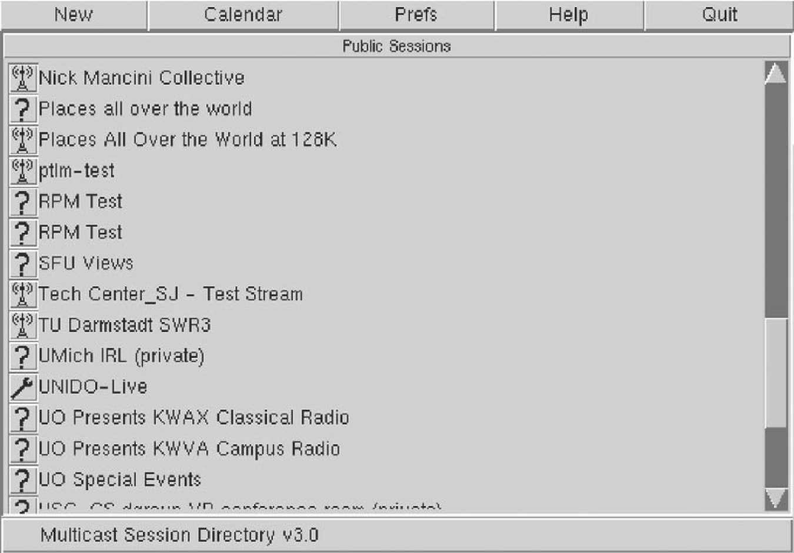
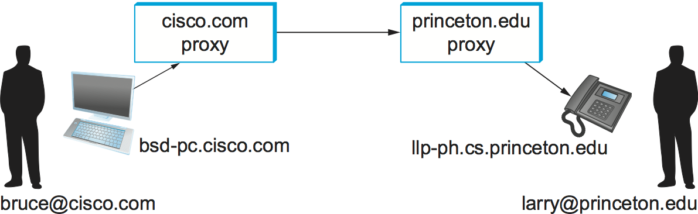
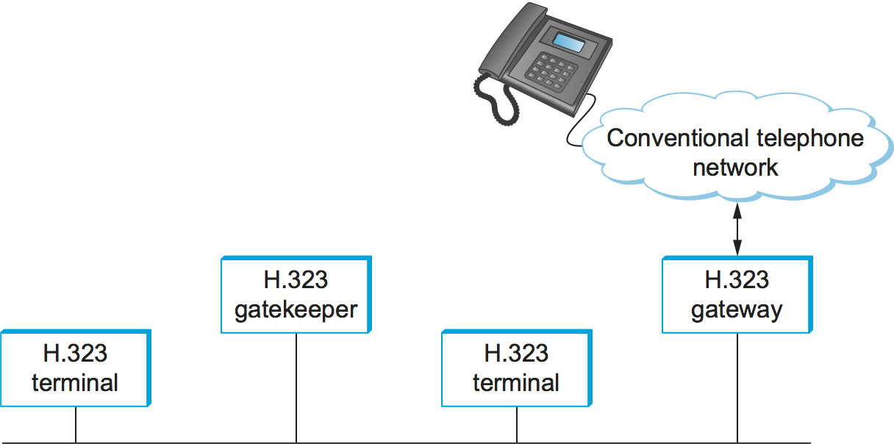
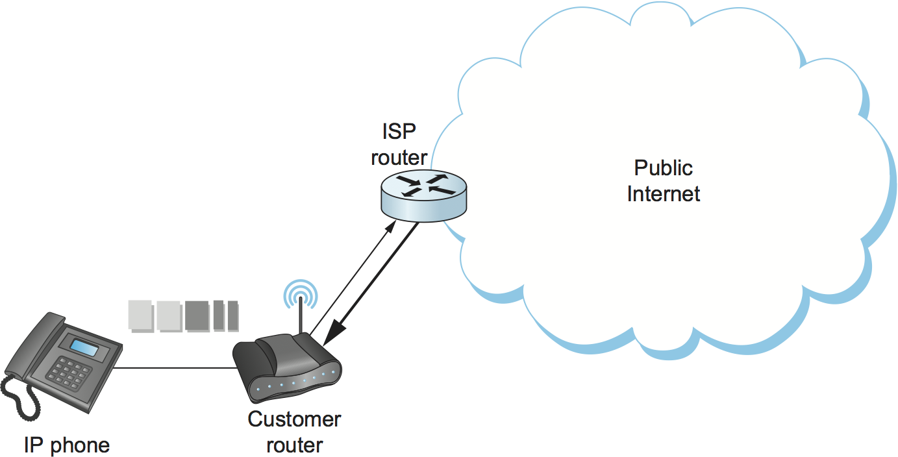
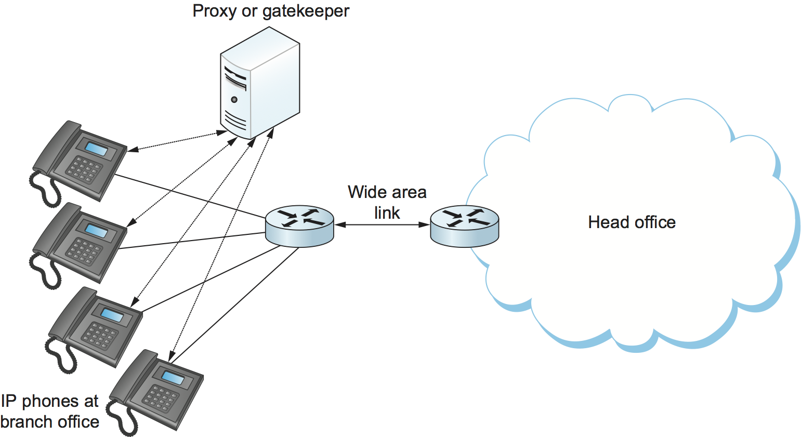
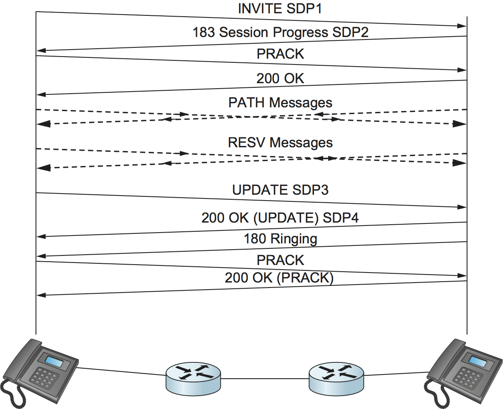

# {{Paj.Toe}}

就像本章前面描述的传统应用程序一样,多媒体应用程序 (如电话和视频会议) 需要它们自己的协议. 多媒体应用协议设计的许多最初经验来自MBOX工具应用程序,例如`vat`和`vic`这是为了在MBOX上开发的,它支持IP组播以实现多方会议.  (更多关于覆盖网络,包括下一节中的MBone. ) 最初,每个应用程序都实现自己的协议 (或协议) ,但是很明显,许多多媒体应用程序具有共同的要求. 这最终导致了多媒体应用程序使用的多个通用协议的开发. 

我们已经看到了多媒体应用程序使用的许多协议. 实时传输协议(RTP)提供多媒体应用所共有的许多功能,例如传送定时信息和识别应用的编码方案和媒体类型. 

资源预留协议(RSVP)可用于请求网络中的资源分配,以便能够向应用程序提供期望的服务质量(QoS). 在本节后面,我们将看到资源分配如何与多媒体应用的其他方面交互. 

除了这些用于多媒体传输和资源分配的协议之外,许多多媒体应用还需要信令或*会话控制*协议. 例如,假设我们希望能够通过因特网拨打电话 (IP电话或VoIP) . 我们需要某种机制来通知预定接收者我们想要与她通话的这种呼叫,例如通过向一些多媒体设备发送消息,使得它发出铃声. 我们还希望能够支持诸如呼叫转发ㄡ三向呼叫等特性. 会话发起协议(SIP)和H.323是解决会话控制问题的协议的示例;我们通过研究这些协议来开始对多媒体应用的讨论. 

## 会话控制和呼叫控制 (SDP,SIP,H.323) 

要理解会话控制的一些问题,请考虑下面的问题. 假设你想在某个时间召开一个视频会议,并让它对广大参与者开放. 也许您已经决定使用MPEG-2标准对视频流进行编码,使用多播IP地址224.1.1.1传输数据,并使用RTP通过UDP端口号4000发送数据. 你会如何让所有的信息提供给预期的参与者?一种方法是将所有这些信息放入电子邮件并发送出去,但理想情况下应该有一个标准的格式和协议来传播这类信息. IETF已经为此目的定义了协议. 已定义的协议包括

-   会话描述协议 (SDP) 

-   会话公告协议 (SAP) 

-   会话发起协议 (SIP) 

-   简单会议控制协议 (SCCP) 

您可能认为这是一个看似简单的任务的许多协议,但是问题的许多方面以及必须解决的几种不同情况. 例如,在宣布某个会议会话将在MBone上可用 (这将使用SDP和SAP完成) 和试图在特定时间向某个用户拨打互联网电话 (这可以使用SDP和SIP完成) 之间存在差异) 在前一种情况下,一旦将所有会话信息以标准格式发送到众所周知的多播地址,就可以考虑完成工作. 在后一种情况下,您需要定位一个或多个用户,向他们获取消息,宣布您希望通话 (类似于拨打他们的电话) ,并且可能在各方之间协商合适的音频编码. 我们将首先介绍SDP,它是许多应用程序所共有的,然后介绍SIP,它被广泛用于许多交互式应用程序,例如因特网电话. 

### 会话描述协议 (SDP) 

会话描述协议(SDP)是一种相当通用的协议,可用于各种情况,并且通常与一个或多个其他协议(例如,SIP)结合使用. 它传达了以下信息: 

-   会议的名称和目的

-   会话的开始和结束时间

-   包括会话的媒体类型 (例如音频ㄡ视频) . 

-   接收会话所需的详细信息 (例如,将向其发送数据的多播地址ㄡ要使用的传输协议ㄡ端口号ㄡ编码方案) 

SDP使用文本行 (每个表单) 的序列以ASCII格式提供此信息. SDP消息的示例将说明要点. 

```pseudo
v=0
o=larry 2890844526 2890842807 IN IP4 128.112.136.10
s=Networking 101
i=A class on computer networking
u=http://www.cs.princeton.edu/
e=larry@cs.princeton.edu
c=IN IP4 224.2.17.12/127
t=2873397496 2873404696
m=audio 49170 RTP/AVP 0
m=video 51372 RTP/AVP 31
m=application 32416 udp wb
```

注意,SDP和HTML一样,对于人来说相当容易阅读,但是具有严格的格式规则,使得机器能够明确地解释数据. 例如,SDP规范定义了允许出现的所有可能的信息类型ㄡ它们必须出现的顺序ㄡ以及所定义的每个类型的格式和保留字. 

首先要注意的是,每个信息类型都由单个字符标识. 例如,该行告诉我们"version"的值是零;也就是说,该消息是根据SDP的版本零进行格式化的. 下一行提供会话的"原点",该会话包含足够的信息来唯一标识会话. `larry`是会话创建者的用户名,是他的计算机的IP地址. 号码跟随`larry`是会话标识符,该会话标识符被选择为该机器唯一的. 然后是SDP公告的"版本"号;如果会话信息被稍后的消息更新,则版本号将增加. 

接下来的三行 (`i`,`s`和`u`(1)提供会话名称ㄡ会话描述和会话统一资源标识符(URI,如本章前面所述),这些信息将有助于用户决定是否参与该会话. 这样的信息可以显示在会话目录工具的用户界面中,该会话目录工具显示使用SDP广告的当前和即将发生的事件. 下一行 (下一行) `e=...`) 包含与会话有关的人的电子邮件地址. [图1](#sdr)显示一个 (有点过时) 会话目录工具的屏幕截图. `sdr`连同在拍摄照片时宣布的几个会议的描述. 

<figure class="line">
	<a id="sdr"></a>
	
	<figcaption>A session directory tool displays information extracted from
	SDP messages.</figcaption>
</figure>
	
Next we get to the technical details that would enable an application
program to participate in the session. The line beginning `c=...`
provides the
IP multicast address to which data for this session will be sent; a user
would need to join this multicast group to receive the session. Next we
see the start and end times for the session (encoded as integers
according to the Network Time Protocol). Finally, we get to the
information about the media for this session. This session has three
media types available—audio, video, and a shared whiteboard
application known as "`wb`." For each media type there is one line of
information formatted as follows:

```pseudo
m=<media> <port> <transport> <format>
```

媒体类型是不言自明的,每种情况下的端口号都是UDP端口. 当我们看"传输"字段时,我们可以看到`wb`应用程序直接在UDP上运行,而音频和视频则使用"RTP/AVP"传输. *应用概况*被称为*AVP*. 该应用程序配置文件为音频和视频定义了许多不同的编码方案;我们可以看到,在这种情况下,音频使用编码0 (这是使用8kHz采样率和每个采样8位的编码) ,而视频使用编码31,它代表H.261编码. 化学. 这些编码方案的"魔术数字"在定义AVP配置文件的RFC中定义;也可以在SDP中描述非标准编码方案. 

最后,我们看到了"WB"媒体类型的描述. 此数据的所有编码信息都是特定于`wb`应用程序,因此只需在"格式"字段中提供应用程序的名称就足够了. 这类似于摆放. `application/wb`在MIME消息中. 

既然我们知道如何描述会话,我们可以看看它们是如何启动的. SDP被使用的一种方式是通过将SDP消息发送到众所周知的多播地址来宣布多媒体会议. 中显示的会话目录工具[图1](#sdr)将通过加入多播组并显示从接收的SDP消息中获取的信息来起作用. SDP还用于IP的娱乐视频(通常称为IPTV)的传递,以提供关于每个电视频道上的视频内容的信息. 

SDP也与会话发起协议 (SIP) 一起起着重要的作用. 随着IP语音的广泛采用 (即,支持IP网络上类似电话的应用) 和基于IP的视频会议,SIP现在是互联网协议套件中更重要的成员之一. 

### 抿

SIP是基于HTTP的某种相似性的应用层协议,其基于类似的请求/响应模型. 然而,它被设计成具有相当不同类型的应用程序,因此提供了与HTTP完全不同的功能. SIP提供的能力可以分为五类: 

-   用户位置确定要与特定用户通信的正确设备

-   用户可用性确定用户是否愿意或能够参与特定的通信会话

-   用户能力确定媒体选择和使用编码方案等项目

-   会话设置,建立会话参数,如通信方使用的端口号

-   会话管理-一系列功能,包括传输会话 (例如,实现"呼叫转发") 和修改会话参数

大多数这些功能很容易理解,但位置问题还有一些进一步的讨论. SIP和HTTP之间的一个重要区别是SIP主要用于人与人之间的通信. 因此,重要的是能够定位个人. *用户*不仅仅是机器. 而且,与电子邮件不同,仅仅定位用户稍后要检查的服务器并将消息转储到该服务器是不够的ℴℴ如果我们想要实时地与他通信,我们需要知道用户现在在哪里. 由于用户可能选择使用一系列不同的设备进行通信,例如当他在办公室时使用他的台式电脑,而在旅行时使用手持设备,所以这更加复杂. 多个设备可能同时处于活动状态,并且可能具有广泛不同的能力 (例如,字母数字寻呼机和基于PC的视频"电话") . 理想情况下,其他用户能够随时在适当的设备上定位和通信. 此外,用户必须能够控制何时ㄡ何地ㄡ以及从何处接收呼叫. 

为了使用户能够对他的呼叫执行适当的控制级别,SIP引入了代理的概念. SIP代理可以被认为是用户与他通信的初始请求被发送的接触点. 代理也代表呼叫者执行功能. 通过一个例子,我们可以看到代理是如何工作的. 

<figure class="line">
	<a id="sipproxy"></a>
	
	<figcaption>Establishing communication through SIP proxies.</figcaption>
</figure>

考虑两个用户[图2](#sipproxy). 首先要注意的是,每个用户都有一个名字的格式,非常像一个电子邮件地址. 当用户布鲁斯想要启动与拉里的会话时,他将其初始SIP消息发送给其域的本地代理. 除此之外,这个初始消息包含*SIP URI*这些是统一资源标识符的一种形式,看起来像这样: 

```pseudo
SIP:larry@princeton.edu
```

SIP URI提供用户的完整标识,但是 (与URL不同) 不提供用户的位置,因为这可能会随着时间而改变. 我们将很快看到用户的位置是如何确定的. 

当从Bruce接收到初始消息时,代理查看SIP URI并推断该消息应该发送到代理. 现在,我们假设代理可以访问一些数据库,这些数据库使代理能够获得从Larry当前希望接收消息的一个或多个设备的名称到IP地址的映射. 因此,代理可以将消息转发给拉里所选的设备. 将消息发送到多个设备被称为*分叉*也可以是并行的或串联的 (例如,如果他不接他桌上的电话,就把它发送到他的手机上) . 

从布鲁斯到拉里的最初信息很可能是一个SIP. `invite`消息,如下所示: 

```pseudo
INVITE sip:larry@princeton.edu SIP/2.0
Via: SIP/2.0/UDP bsd-pc.cisco.com;branch=z9hG4bK433yte4
To: Larry <sip:larry@princeton.edu>
From: Bruce <sip:bruce@cisco.com>;tag=55123
Call-ID: xy745jj210re3@bsd-pc.cisco.com
CSeq: 271828 INVITE
Contact: <sip:bruce@bsd-pc.cisco.com>
Content-Type: application/sdp
Content-Length: 142
```

第一行标识要执行的函数的类型 (`invite`) 执行它的资源ㄡ被叫方 () 和协议版本 (2) . 随后的头行可能看起来有些熟悉,因为它们与电子邮件消息中的标题行相似. SIP定义了大量的头字段,这里仅描述了其中一些. 注意,本示例中的标题标识了该消息所源自的设备. 头部和标题描述消息在标题后面的内容,就像在MIME编码的电子邮件中一样. 在这种情况下,内容是一个SDP消息. 该消息将描述Bruce希望与Larry交换的媒体 (音频ㄡ视频等) 类型以及会话的其他属性,比如他支持的编解码器类型. 请注意,SIP中的字段提供了使用此协议的能力,尽管SDP是最常见的. 

返回到示例时,当`invite`消息到达代理,代理不仅转发消息,而且还响应发送者. `invite`. 就像HTTP一样,所有的响应都有一个响应代码,代码的组织与HTTP相似. 在[图3](#sipeg)我们可以看到一系列的SIP消息和响应. 

<figure class="line">
	<a id="sipeg"></a>
	
	<figcaption>Message flow for a basic SIP session.</figcaption>
</figure>

此图中的第一个响应消息是临时响应,它指示调用方的代理没有错误地接收到消息. 一旦`invite`它被传送到拉里的电话,它提醒拉里并用一个消息回应. 这个信息到达布鲁斯的电脑是一个信号,表明它可以产生一个"铃声". 假设拉里愿意和能够与布鲁斯通信,他可以拿起他的电话,使信息被发送. 布鲁斯的电脑响应`ACK`并且媒体 (例如,RTP封装的音频流) 现在可以开始在两方之间流动. 注意,在这一点上,当事人知道对方的地址,所以`ACK`可以直接发送,绕过代理. 代理不再参与到呼叫中. 请注意,媒体通常会通过网络而不是原始信令消息采取不同的路径. 此外,即使其中一个或两个代理在这一点崩溃,呼叫也可以正常继续. 最后,当一方希望结束会话时,它发送一个`BYE`消息,在正常情况下引起响应. 

有一些细节我们已经讨论过了. 一个是会话特性的协商. 也许布鲁斯会喜欢用音频和视频进行交流,但拉里的手机只支持音频. 因此,考虑到Bruceℹs提出的选项,Larry的电话会在描述会话属性时发送SDP消息,拉里和设备可以接受这些属性`invite`. 以这种方式,在媒体流开始之前同意相互可接受的会话参数. 

我们所关注的另一个大问题是为拉里找到正确的设备. 首先,布鲁斯的电脑必须发送它的`invite`给代理人. 这可能是计算机中的一个配置信息,或者它可以由DHCP学习. 然后代理必须找到代理. 这可以通过使用特殊类型的DNS查找来完成,以便返回域的SIP代理的IP地址.  (我们将在下一节中讨论DNS如何做到这一点. ) 最后,代理必须找到可以联系Larry的设备. 通常,代理服务器可以访问可以以多种方式填充的位置数据库. 手动配置是一种选择,但更灵活的选择是使用*注册*SIP的能力. 

用户可以通过发送SIP向位置服务注册. `register`向"注册者"发送域名信息. 此消息在"记录地址"和"联系地址"之间创建绑定. 这正是代理在我们的示例中所需要的绑定. 

注意,用户可以在多个位置注册,并且多个用户可以在单个设备上注册. 例如,人们可以想象一群人走进一个配备有IP电话的会议室,并且所有人都在IP电话上注册,以便他们可以在那个电话上接收电话. 

SIP是一个非常丰富和灵活的协议,可以支持各种复杂的调用场景以及很少或与电话无关的应用程序. 例如,SIP支持使呼叫被路由到"音乐保持"服务器或语音邮件服务器的操作. 也很容易看出如何将其用于诸如即时消息传递之类的应用程序,并且在编写本文时正在进行用于此类目的的SIP扩展的标准化. 

### H.323

国际电信联盟 (国际电联) 在呼叫控制领域也非常活跃,这不足为奇,因为它与该机构的传统领域ℴℴ电话有关. 幸运的是,IETF与ITU之间在这个实例中已经进行了相当大的协调,使得各种协议具有一定的互操作性. 在分组网络上进行多媒体通信的主要ITU推荐称为*H.323*它将许多其他建议联系在一起,包括H225呼叫控制. H.323所涵盖的全部建议可以运行到数百页,并且该协议以其复杂性而闻名,因此在这里只能给出它的简要概述. 

H.323作为互联网电话的协议,包括视频电话,是很受欢迎的,我们在这里考虑这类应用. 发起或终止呼叫的设备被称为H.323终端;这可能是运行因特网电话应用程序的工作站,或者可能是专门设计的"设备"ℴℴ例如具有联网软件和以太网端口的电话式设备. H.323终端可以彼此直接通话,但呼叫经常被称为"A"的设备介导. *看门人*. 看门狗执行多个功能,例如在电话呼叫中使用的各种地址格式之间的转换和控制在给定时间内可以放置多少个呼叫来限制H.323应用所使用的带宽. H.323还包含了*网关*,它将H.323网络连接到其他类型的网络. 网关的最常用的用途是将H.323网络连接到公共交换电话网络 (PSTN) ,如图所示. [图4](#h323). 这使得在计算机上运行H.323应用程序的用户能够在公共电话网络上使用传统电话与人交谈. 守门人执行的一个有用功能是帮助终端找到网关,或者在几个选项中选择以找到一个相对接近呼叫最终目的地的网关. 这在传统电话大大超过基于PC的电话的世界中显然是有用的. 当H.323终端对传统电话的端点进行呼叫时,网关成为H.323呼叫的有效端点,并负责对信令信息和需要通过电话进行的媒体流进行适当的翻译. 网络. 

<figure class="line">
	<a id="h323"></a>
	
	<figcaption>Devices in an H.323 network.</figcaption>
</figure>

H.323的一个重要部分是H.245协议,它用于协商呼叫的属性,有点类似于上面描述的SDP的使用. H.245消息可能列出了它可以支持的许多不同的音频编解码器标准;呼叫的远端端点将用它自己支持的编解码器的列表来回复,并且两端可以选择它们都可以接受的编码标准. H.245还可以用于向UDP端口号发送信号,RTP和实时控制协议(RTCP)将使用UDP端口号来对媒体流(或流-呼叫可能包括音频和视频两者,例如)进行此呼叫. 一旦完成,呼叫就可以继续进行,RTP用于传输媒体流,RTCP承载相关的控制信息. 

## 多媒体应用中的资源分配

正如我们刚刚看到的,会话控制协议如SIP和H.323可以用于在多媒体应用中发起和控制通信,而RTP为应用的数据流提供传输级功能. 使多媒体应用程序工作的最后一个难题是确保在网络内部分配适当的资源,以确保满足应用程序的服务质量需求. 在前面的章节中,我们提出了许多资源分配方法. 开发这些技术的动机很大程度上是为了支持多媒体应用. 那么,应用程序如何利用网络的底层资源分配能力呢?

值得注意的是,许多多媒体应用在"尽力而为"网络 (如公共互联网) 上成功运行. 各种各样的商业VOIP服务 (如Skype) 证明了这样一个事实,即当资源不充足时,您只需要担心资源分配,而在当今互联网的许多地方,资源充足是常态. 

像RTCP这样的协议可以通过向应用程序提供关于网络所传递的服务质量的详细信息来帮助尽力网络中的应用. 回想一下,RTCP承载关于多媒体应用中参与者之间的丢失率和延迟特性的信息. 例如,当带宽稀缺时,应用程序可以使用该信息来将其编码方案改变为低比特率编解码器. 注意,当丢失率高时,可能希望更改为发送附加冗余信息的编解码器,但这是不赞成的;它类似于*增加的*TCP窗口大小在丢失的情况下,正好相反,需要什么避免拥塞崩溃. 

如前章所讨论的,区分服务 (.Serv) 可用于为应用程序提供相当基本和可伸缩的资源分配. 多媒体应用程序可以在其生成的分组的IP报头中设置区分服务代码点(DSCP),以确保媒体和控制分组都接收适当的服务质量. 例如,通常将语音媒体分组标记为"EF" (加速转发) 以使它们被放置在沿路径的路由器中的低延迟或优先级队列中,而呼叫信令 (例如,SIP) 分组通常被标记为某种"AF" (保证转发) 以使它们能够与最大努力流量分开排队,从而降低他们的损失风险. 

当然,只有在诸如路由器之类的网络设备注意DSCP时,在发送主机或设备内标记数据包才有意义. 一般来说,在公共互联网中的路由器忽略DSCP,为所有包提供尽力而为的服务. 然而,企业或公司网络有能力使用.Serv进行内部多媒体通信,并且经常这样做. 此外,即使因特网的居民用户也能够仅仅通过在其因特网连接的出站方向上使用.Serv来提高VOIP或其他多媒体应用的质量,如下所示[图5](#ds-bb). 这是有效的,因为许多宽带因特网连接的不对称性: 如果出站链路比入站链路慢得多 (即,资源受限更多) ,那么在该链路上使用.Serv的资源分配可能足以使延迟的质量有所不同-aND损失敏感的应用. 

<figure class="line">
	<a id="ds-bb"></a>
	
	<figcaption>Differentiated Services applied to a VOIP application.
	DiffServ queueing is applied only on the upstream link from customer
    router to ISP.</figcaption>
</figure>

虽然DiffServ呼吁其简单性,很明显,它不能满足应用的需求在所有条件下. 例如,假设上行带宽[图5](#ds-bb)只有100 kbps,客户尝试放置两个VoIP呼叫,每个都有64 kbps编解码器. 显然,上行链路现在负载超过100%,这将导致大的排队延迟和丢失的数据包. 客户路由器中没有足够的聪明队列可以解决这个问题. 

许多多媒体应用的特点是,与其试图将太多的呼叫挤入太窄的管道中,不如阻塞一个呼叫同时允许另一个呼叫继续进行. 也就是说,最好让一个人成功地进行会话,而另一个人听到一个忙碌的信号,而不是让两个呼叫者同时经历不可接受的音频质量. 我们有时把这样的应用称为*陡峭效用曲线*这意味着随着网络提供的服务质量下降,应用程序的实用性 (有用性) 迅速下降. 多媒体应用程序通常具有这种属性,而许多传统应用程序却没有这样的特性. 电子邮件,例如,继续工作很好,即使拖延到小时. 

具有陡峭效用曲线的应用通常非常适合于某种形式的接纳控制. 如果您不能确保始终有足够的资源可用来支持所提供的应用程序负载,那么准入控制提供了对某些应用程序说"不"的方法,同时允许其他应用程序获得它们需要的资源. 

我们在前面的章节中看到了一种使用RSVP进行准入控制的方法,我们将很快返回到这一点,但是使用会话控制协议的多媒体应用程序提供了一些其他的准入控制选项. 这里要观察的关键点是,会话控制协议 (如SIP或H.323) 经常涉及在呼叫或会话开始时在端点和另一实体 (SIP代理或H.323门卫) 之间的某种消息交换. 这可以提供一种方便的方式来对没有足够资源的新呼叫说"不". 

作为一个例子,考虑网络[图6](#cm-cac). 假设从分公司到总部的广域链路具有足够的带宽,能够同时使用64kbps编解码器容纳三个VOIP呼叫. 当电话开始呼叫时,每个电话已经需要与本地SIP代理或H.323网守进行通信,因此,代理/看门人很容易返回一个消息,该消息告诉IP电话如果该链路已经完全加载,则播放繁忙的信号. 代理或看门人甚至可以处理特定IP电话可能同时进行多个呼叫并且可以使用不同的编解码器速度的可能性. 然而,这种方案只有在没有其他设备能够在没有首先与看门人或代理对话的情况下超载链路的情况下才能工作. DiffServ队列可以用来确保,例如,参与文件传输的PC不干扰VoIP呼叫. 但是,假设在远程办公室启用了一些不首先与守门人或代理对话的VoIP应用程序. 这样的应用程序,如果它能正确地和与现有的VoIP业务相同的队列中得到它的分组,则可以清楚地驱动链路到过载点,而没有来自代理或网守的反馈. 

<figure class="line">
	<a id="cm-cac"></a>
	
	<figcaption>Admission control using session control
    protocol.</figcaption>
</figure>

刚才描述的方法的另一个问题是它依赖于看门人或代理,知道每个应用程序使用的路径. 在简单的拓扑结构中[图6](#cm-cac)这不是一个大问题,但在更复杂的网络中,它很快就会变得难以管理. 我们只需要设想这样的情况,即远程办公室与外部世界有两种不同的连接,以了解我们正在要求代理或门卫不仅理解SIP或H.323,而且理解路由ㄡ链路故障和当前网络条件. 这很快就会变得难以管理. 

我们参考刚才描述的接纳控制类型. *偏离路径*也就是说,作出准入控制决策的设备不位于需要分配资源的数据路径上. 显而易见的选择是*路径上*准入控制,以及在IP网络中进行路径上准入控制的协议的标准示例是资源预留协议(RSVP). 在前面的章节中,我们看到了如何使用RSVP来确保沿着路径分配足够的资源,并且在本节中描述的应用程序中使用RSVP非常简单. 仍然需要填写的一个细节是接纳控制协议如何与会话控制协议交互. 

<figure class="line">
	<a id="sip-sync"></a>
	
	<figcaption>Coordination of SIP signalling and resource
	reservation.</figcaption>
</figure>

协调接纳控制 (或资源预留) 协议和会话控制协议的动作不是火箭科学,但它确实需要对细节进行一些注意. 作为一个例子,考虑双方之间的简单电话呼叫. 在您进行预订之前,您需要知道调用将使用多少带宽,这意味着您需要知道要使用什么编解码器. 这意味着您需要首先进行一些会话控制,以交换关于两部电话支持的编解码器的信息. 但是,你做不到*全部的*首先是会话控制,因为在作出准入控制决定之前,不希望电话响起,以防准入控制失败. [图7](#sip-sync)说明使用SIP进行会话控制和使用RSVP进行接纳控制决策的情况 (在本例中是成功的) . 

这里要注意的主要问题是会话控制和资源分配任务的交织. 实线表示SIP消息,虚线表示RSVP消息. 注意,在这个示例中,SIP消息是从电话向电话发送的 (即,我们没有显示任何SIP代理) ,而RSVP消息也是由中间的路由器处理的,作为对允许呼叫的足够资源的检查. 

我们从前两个SIP消息中的编解码器信息的初始交换开始 (回想一下,SDP用于列出可用的编解码器,等等) . `PRACK`是一个"临时确认",一旦这些消息被交换,RSVP`PATH`消息包含所需资源量的描述,可以作为在呼叫的两个方向上预留资源的第一步发送. 下一步,`RESV`可以将消息发送回实际保留资源. 曾经一次`RESV`由发起电话接收,它可以发送更新的SDP消息,报告资源已经在一个方向上被预留的事实. 当被叫电话接收到该消息时`RESV`从另一部电话中,它可以开始按铃,并告诉另一部电话现在在两个方向上都保留了资源 (带有SDP消息) ,并且还通知呼叫电话它正在按铃. 从这里开始,正常的SIP信令和媒体流,类似于[图3](#sipeg)收益. 

我们再次看到构建应用程序是如何要求我们理解不同构建块 (在本例中为SIP和RSVP) 之间的交互的. SIP的设计者实际上对协议做了一些更改,以使具有不同作业的协议之间的功能能够交错,因此我们在本书中重复强调关注于完整的系统,而不仅仅是孤立地看待一个层或组件. 系统的TS. 
