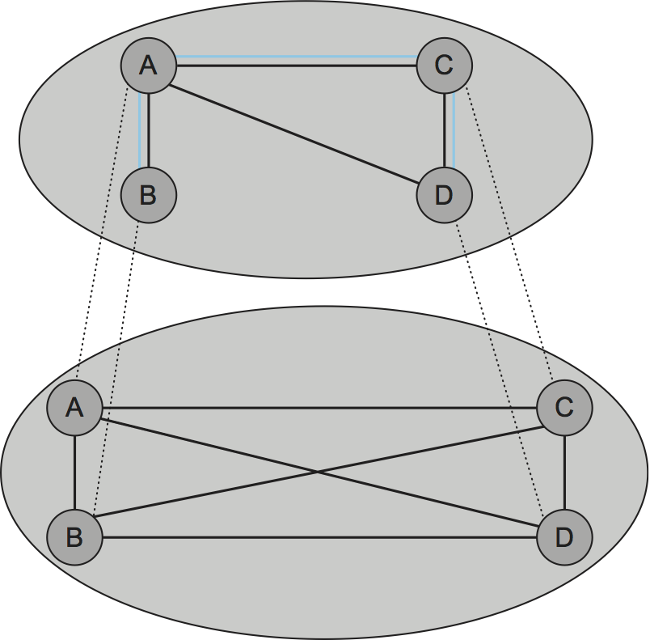
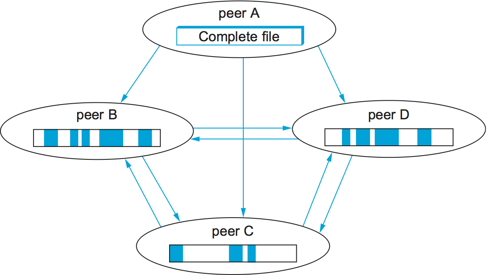

# {{ 页面标题 }}

从一开始,Internet就采用了一种简洁的模型,其中网络内的路由器负责将数据包从源转发到目的地,应用程序在连接到网络边缘的主机上运行. 本章前两节中讨论的应用程序说明的客户端/服务器范例当然遵循此模型. 

然而,在过去几年中,区别*包转发*和*申请处理*变得不那么清楚了. 新的应用程序正在Internet上分发,在许多情况下,这些应用程序会自行做出转发决策. 这些新的混合应用程序有时可以通过扩展传统路由器和交换机来实现,以支持适量的特定于应用程序的处理. 例如,所谓的*7级开关*坐在服务器群集前面,并根据请求的URL将HTTP请求转发到特定服务器. 然而,*覆盖网络*正迅速成为将新功能引入互联网的首选机制. 

<figure class="line">
	<a id="overlay"></a>
	
	<figcaption>Overlay network layered on top of a physical network.</figcaption>
</figure>

您可以将覆盖视为在某些底层网络上实现的逻辑网络. 根据这个定义,互联网最初是作为旧电话网络提供的链路之上的覆盖网络. [图1](#overlay)描绘了在底层网络上实现的叠加. 覆盖中的每个节点也存在于底层网络中;它以特定于应用程序的方式处理和转发数据包. 连接覆盖节点的链路通过底层网络实现为隧道. 多个覆盖网络可以存在于同一个底层网络之上 - 每个网络都实现自己的特定于应用程序的行为 - 并且覆盖可以嵌套,一个在另一个之上. 例如,本节中讨论的所有示例覆盖网络都将当今的Internet视为底层网络. 

<figure class="line">
	<a id="tunnel"></a>
	
	<figcaption>Overlay nodes tunnel through physical nodes.</figcaption>
</figure>
	
We have already seen examples of tunneling, for example, to implement
virtual private networks (VPNs). As a brief refresher, the nodes on
either end of a tunnel treat the multi-hop path between them as a single
logical link, the nodes that are tunneled through forward packets based
on the outer header, never aware that the end nodes have attached an
inner header. [Figure 2](#tunnel) shows three overlay nodes (A, B, and
C) connected by a pair of tunnels. In this example, overlay node B might
make a forwarding decision for packets from A to C based on the inner
header (`IHdr`), and then attach an outer header (`OHdr`) that
identifies C as the destination in the underlying network. Nodes A, B,
and C are able to interpret both the inner and outer header, whereas the
intermediate routers understand only the outer header. Similarly, A, B,
and C have addresses in both the overlay network and the underlying
network, but they are not necessarily the same; for example, their
underlying address might be a 32-bit IP address, while their overlay
address might be an experimental 128-bit address. In fact, the overlay
need not use conventional addresses at all but may route based on URLs,
domain names, an XML query, or even the content of the packet.

## 路由覆盖

最简单的覆盖是纯粹为了支持替代路由策略而存在的覆盖;在覆盖节点处不执行额外的应用级处理. 您可以将虚拟专用网络 (VPN) 视为路由覆盖的示例,但不会定义替代策略或算法,因为它会使标准IP转发算法处理备用路由表条目. 在这种特殊情况下,覆盖层被称为使用"IP隧道",并且在许多商用路由器中支持使用这些VPN的能力. 

但是,假设您想使用商业路由器供应商不愿意在其产品中包含的路由算法. 你会怎么做呢?您只需在一组终端主机上运行算法,然后通过Internet路由器进行隧道传输. 这些主机的行为类似于覆盖网络中的路由器: 作为主机,它们可能仅通过一个物理链路连接到Internet,但作为覆盖中的节点,它们将通过隧道连接到多个邻居. 

由于叠加 (几乎按定义) 是一种独立于标准化过程引入新技术的方法,因此没有标准叠加我们可以指出作为示例. 相反,我们通过描述由网络研究人员构建的几个实验系统来说明路由覆盖的一般概念. 

### IP的实验版本

覆盖层非常适合部署您希望最终将覆盖全球的IP实验版本. 例如,IP多播作为IP的扩展开始,甚至在许多互联网路由器中都没有启用. MBone (多播骨干网) 是一个覆盖网络,它在Internet提供的单播路由之上实现IP多播. 为Mbone开发并部署了许多多媒体会议工具. 例如,IETF会议 - 为期一周,吸引了数千名参与者 - 多年来一直在MBone上播出. 

与VPN类似,MBone同时使用IP隧道和IP地址,但与VPN不同,MBone实现了不同的转发算法 - 将数据包转发到最短路径组播树中的所有下游邻居. 作为覆盖,多播感知路由器穿过传统路由器,希望有一天将不再有传统路由器. 

6-BONE是用于递增部署IPv6的类似覆盖. 与MBone一样,6-BONE使用隧道通过IPv4路由器转发数据包. 然而,与MBone不同,6-BONE节点并不仅仅提供IPv4的32位地址的新解释. 相反,他们根据IPv6的128位地址空间转发数据包. 6-BONE还支持IPv6组播. 

### 终端系统组播

虽然IP多播受到研究人员和网络社区某些部门的欢迎,但其在全球互联网中的部署充其量是有限的. 作为回应,基于多播的应用程序 (如视频会议) 最近已转向另一种策略,称为*终端系统组播*. 终端系统多播的想法是接受IP多播永远不会普遍存在,而是让参与特定基于多播的应用程序的终端主机实现它们自己的多播树. 

在描述终端系统组播如何工作之前,首先要了解的是,与VPN和MBone不同,终端系统组播假设只有Internet主机 (而不是Internet路由器) 参与覆盖. 此外,这些主机通常通过UDP隧道而不是IP隧道相互交换消息,从而使其易于作为常规应用程序实现. 这使得可以将底层网络视为完全连接的图,因为因特网中的每个主机都能够向每个其他主机发送消息. 抽象地说,终端系统组播解决了以下问题: 从表示Internet的完全连接图开始,目标是找到跨越所有组成员的嵌入式组播树. 

<figure class="line">
	<a id="topology"></a>
	
	<figcaption>Alternative multicast trees mapped onto a physical
	toploogy.</figcaption>
</figure>

由于我们将底层互联网完全连接起来,一个天真的解决方案是将每个源直接连接到该组的每个成员. 换句话说,可以通过让每个节点向每个组成员发送单播消息来实现终端系统多播. 要查看这样做的问题,特别是与在路由器中实现IP多播相比,请考虑示例拓扑[图3](#topology).[图3 (a) ](#topology)描述了一个示例物理拓扑,其中R1和R2是通过低带宽跨大陆链路连接的路由器;AㄡBㄡC和D是终端主机;并且链路延迟作为边缘权重给出. 假设想要向其他三个主机发送多播消息,[图3 (b) ](#topology)显示天真的单播传输将如何工作. 这显然是不可取的,因为相同的消息必须遍历链接A-R1三次,并且消息的两个副本遍历R1-R2. [图3 (c) ](#topology)描述了距离矢量组播路由协议 (DVMRP) 构建的IP组播树. 显然,这种方法消除了冗余消息. 然而,如果没有路由器的支持,对于终端系统多播来说,最好的希望是类似于[图3 (d) ](#topology). 端系统组播定义了一种构建该树的体系结构. 

<figure class="line">
	<a id="layered-overlays"></a>
	
	<figcaption>Multicast tree embedded in an overlay network.</figcaption>
</figure>

通常的方法是支持多级覆盖网络,每个覆盖网络从其下面的覆盖中提取子图,直到我们选择了应用程序期望的子图. 对于端系统组播,特别是,这两个阶段发生: 首先,我们构造一个简单的*网格*在完全连接的Internet上覆盖,然后在该网格中选择多播树. 这个想法在[图4](#layered-overlays)第一步是关键的一步: 一旦我们选择了合适的网格覆盖,我们就简单地在它上面运行一个标准的多播路由算法 (例如,DVMRP) 来构建多播树. 我们还可以忽略Internet范围的多播面临的可伸缩性问题,因为可以选择中间网格来仅包括那些希望参与特定多播组的节点. 

构造中间网格覆盖的关键是选择大致与底层Internet的物理拓扑相对应的拓扑,但是我们必须这样做,而不需要任何人告诉我们底层Internet的实际样子,因为我们只在终端主机上运行,而没有T路由器. 一般的策略是终端主机测量到其他节点的往返延迟,并决定只在他们喜欢的时候才向网格添加链接. 这工作如下. 

首先,假设网格已经存在,每个节点与其直接连接的邻居交换它认为是网格一部分的所有其他节点的列表. 当节点从邻居接收到这样的成员列表时,它将该信息合并到它的成员列表中,并将所得到的列表转发给它的邻居. 该信息最终通过网格传播,就像在距离矢量路由协议中一样. 

当主机想要加入多播覆盖时,它必须知道覆盖中已经存在的至少一个其他节点的IP地址. 然后发送一个"连接网格"消息给这个节点. 这通过边缘与已知节点连接新节点到网格. 通常,新节点可以向多个当前节点发送连接消息,从而通过多个链路加入网格. 一旦节点通过一组链接连接到网格,它就周期性地向其邻居发送"保持活力"消息,让他们知道它仍然希望成为该组的一部分. 

当一个节点离开组时,它发送一个"离开网格"消息给它的直接连接的邻居,并且这个信息通过上面描述的成员列表传播到网格中的其他节点. 或者,节点可能失败,或者只是默默地决定退出组,在这种情况下,它的邻居检测到它不再发送"保持活力"消息. 一些节点偏离对网格的影响很小,但是如果一个节点检测到由于一个离开的节点而导致网格被划分,它通过发送一个"连接网格"消息给另一个分区中的节点创建一个新的边缘. 注意,多个邻居可以同时确定网格中已经出现分区,从而导致多个交叉分区边缘被添加到网格中. 

正如到目前为止所描述的,我们将最终得到一个网格,它是原始完全连接的Internet的子图,但是它可能具有次优的性能,因为(1)初始邻居选择向拓扑添加随机链接,(2)分区修复可能添加当前但不是必需的边缘. 从长远来看,(3)由于动态连接和偏离,组成员关系可能改变,(4)基础网络条件可能改变. 需要做的是系统必须评估每个边缘的值,导致新的边缘被添加到网格中,并且随着时间推移现有的边缘被去除. 

为了添加新的边,每个节点$$i$$周期性地探测它当前在网格中未连接的随机成员$$j$$,测量边$$(i,j)$$的往返延迟,然后评估添加这个边的效用. 如果效用高于某个阈值,链接$$ (i,j) $$被添加到网格中. 评估添加边缘$$ (i,j) $$的效用可能是这样的: 

```pseudo
EvaluateUtility(j)
    utility = 0
    for each member m not equal to i
        CL = current latency to node m along route through mesh
        NL = new latency to node m along mesh if edge (i,j) is added}
        if (NL < CL) then
            utility += (CL - NL)/CL
    return utility
```

决定删除一个边缘是相似的,除了每个节点$$i$$计算每个链接到当前邻居$J$$的成本如下: 

```pseudo
EvaluateCost(j)
    Cost[i,j] = number of members for which i uses j as next hop
    Cost[j,i] = number of members for which j uses i as next hop
    return max(Cost[i,j], Cost[j,i])
```

然后,它以最低的成本选择邻居,如果成本低于某一阈值,则将其丢弃. 

最后,由于网格是使用距离向量协议来维护的,所以运行DVMRP在网格中找到合适的多播树是很简单的. 注意,尽管不可能证明刚才描述的协议导致最佳的网状网络,从而允许DVMRP选择最佳的可能的多播树,但是仿真和广泛的实践经验都表明它做得很好. 

### 弹性覆盖网络

覆盖可以执行的另一个功能是为传统单播应用寻找替代路由. 这样的覆盖利用了三角不等式在互联网上不成立的观察. [图5](#triangle)说明了我们的意思. 在Internet上找到三个站点 (称为AㄡB和C) 并不罕见,这样A和B之间的延迟大于从A到C和C到B的延迟的总和. 直接把它们送到目的地. 

<figure class="line">
	<a id="triangle"></a>
	
	<figcaption>The triangle inequality does not necessarily hold in
	networks.</figcaption>
</figure>

这怎么可能呢?嗯,边界网关协议 (BGP) 从未承诺它会找到*最短的*在任何两个站点之间的路由;它只试图找到*一些*路线. 更复杂的是,BGP的路线受到政策问题的严重影响,比如谁付钱给谁来运输交通工具. 这经常发生,例如,在主要骨干ISPS之间的对等点. 简而言之,三角不等式在互联网上不成立,不应该令人惊讶. 

我们如何利用这个观察?第一步是要认识到,在路由算法的可伸缩性和最优性之间存在基本的折衷. 一方面,BGP扩展到非常大的网络,但是通常不选择最好的可能路由,并且适应网络中断的速度很慢. 另一方面,如果您只担心在少数站点中找到最佳路径,那么您可以更好地监视可能使用的每条路径的质量,从而允许您随时选择最佳可能路径. 

一个实验覆盖,称为弹性覆盖网络 (RON) ,正好做到这一点. RON只扩展到几十个节点,因为它使用每对站点之间密切监视 (通过活动探测) 路径质量 (延迟ㄡ可用带宽和丢失概率) 的三个方面的$n乘以$n$策略. 然后,它能够在任何节点对之间选择最佳路由,并且在网络条件改变的情况下快速改变路由. 经验表明,Ron能够为应用程序提供适度的性能改进,但更重要的是,它更快地从网络故障中恢复. 例如,在2001小时的64小时期间,在12个节点上运行的RON的实例检测到持续30分钟的32次中断,并且能够在平均20秒内从所有故障中恢复. 该实验还表明,仅通过一个中间节点转发数据通常足以从互联网故障恢复. 

因为RON不是被设计成可伸缩的方法,所以不可能使用RON来帮助随机主机A与随机主机B通信;A和B必须提前知道他们很可能通信,然后加入相同的RON. 然而,在某些情况下,RON似乎是个好主意,比如连接遍布互联网的几十个公司网站,或者允许您和50个朋友为了运行某些应用程序而建立自己的私有覆盖. 然而,真正的问题是当每个人都开始经营自己的罗恩时会发生什么. 数百万RON积极地探测路径的开销是否淹没了网络,并且当许多RON竞争相同的路径时,有没有人看到改进的行为?这些问题仍然没有答案. 

所有这些覆盖说明了一个概念,这是计算机网络的核心: *虚拟化*. 也就是说,可以在由物理资源构建的物理网络之上从抽象 (逻辑) 资源构建虚拟网络. 此外,可以将这些虚拟化网络堆叠到彼此之上,并使多个虚拟网络在同一级别上共存. 每个虚拟网络又提供对一些用户ㄡ应用程序或更高层网络有价值的新功能. 

## 对等网络

Napster和KAZAA等音乐分享应用程序将术语"对等"引入流行的白话文中. 但是,对于一个系统来说,"对等"究竟意味着什么呢?当然,在共享MP3文件的上下文中,这意味着不必从中心站点下载音乐,而是能够直接从互联网上的任何人那里访问音乐文件,碰巧在他们的计算机上存储了副本. 更一般地,我们可以说,对等网络允许用户社区汇集他们的资源 (内容ㄡ存储ㄡ网络带宽ㄡ磁盘带宽ㄡCPU) ,从而提供对更大的档案存储ㄡ更大的视频/音频会议ㄡ更复杂的搜索和计算的访问,等等,比任何一个用户都能负担得起. 

通常,属性像*分散的*和*自组织*在讨论对等网络时提到,这意味着各个节点在没有任何集中协调的情况下将自己组织成一个网络. 如果你想一下,像这样的术语可以用来描述互联网本身. 然而,具有讽刺意味的是,根据这个定义,Napster不是一个真正的对等系统,因为它依赖于已知文件的中央注册中心,并且用户必须搜索这个目录才能找到哪台机器提供了特定的文件. 这只是在属于两个用户的机器之间进行的最后一步ℴℴ实际下载文件,但这仅是传统的客户端/服务器事务. 唯一不同的是,服务器是由像你这样的人拥有的,而不是一个大公司. 

所以我们回到了最初的问题: 对等网络有什么意思?一个答案是,定位感兴趣的对象的过程和下载该对象到本地机器的过程都是在不需要联系集中式权限的情况下发生的,同时系统能够扩展到数百万个节点. 能够以分散的方式完成这两个任务的对等系统被证明是一个覆盖网络,其中节点是那些愿意共享感兴趣的对象 (例如,音乐和其他各种文件) 的主机,并且连接这些节点的链接 (隧道) 表示你必须访问的机器序列来追踪你想要的对象. 在我们看了两个例子之后,这个描述将变得更加清晰. 

### 果蝇

Gnutella是一个早期的对等网络,它试图区分交换音乐 (这很可能侵犯某人的版权) 和文件的一般共享 (自从我们两岁起就被教导共享,这肯定是好事) . Gnutella有趣的是,它是第一个不依赖于对象集中注册中心的系统. 取而代之的是,Gnutella参与者将自己安排到一个类似于所示的覆盖网络中. [图6](#gnutella). 也就是说,运行Gnutella软件的每个节点 (即,实现Gnutella协议) 都知道一些运行Gnutella软件的其他机器集. "A和B相互认识"的关系对应于图中的边.  (我们将讨论这个图形是如何形成的. ) 

<figure class="line">
	<a id="gnutella"></a>
	
	<figcaption>Example topology of a gnutella peer-to-peer
	network.</figcaption>
</figure>

每当给定节点上的用户想要查找对象时,Gnutella就会向图中的邻居发送对象的QUERY消息 (例如,指定文件名) . 如果一个邻居拥有该对象,则它用QUERY RESPONSE消息响应向其发送查询的节点,指定可以在哪里下载该对象 (例如,IP地址和TCP端口号) . 该节点随后可以使用获取或放置消息访问对象. 如果节点无法解析该查询,则它将QUERY消息转发给它的每个邻居 (除了发送该查询的那个之外) ,并重复该过程. 换句话说,Gnutella淹没覆盖物来定位所需的物体. Gnutella在每个查询上设置一个TTL,所以洪水不会无限期地继续下去. 

除了TTL和查询字符串之外,每个QUERY消息还包含唯一的查询标识符 (QID) ,但是它不包含原始消息源的标识. 相反,每个节点维护它最近看到的QUERY消息的记录: QID和发送QUERY的邻居两者. 它以两种方式使用这个历史. 首先,如果它接收到一个QID查询,该QID与它最近看到的一个匹配,则该节点不转发查询消息. 这比TTL可能更快地切断转发循环. 第二,每当节点从下游邻居接收到查询响应时,它知道将响应转发给最初向其发送QUERY消息的上游邻居. 通过这种方式,响应返回到原始节点,而没有任何中间节点知道谁首先要定位这个特定对象. 

回到图形如何发展的问题,当节点加入Gnutella覆盖时,它当然必须知道至少一个其他节点. 新节点通过至少一个链路连接到覆盖. 之后,给定节点通过QUERY RESPONSE消息了解其他节点,包括它请求的对象和刚好经过它的响应. 一个节点可以自由地决定它以哪种方式发现它想要保持为邻居. Gnutella协议提供PING和PONG消息,节点通过它们分别探测给定的邻居是否仍然存在以及该邻居的响应. 

应该清楚的是,这里描述的Gnutella并不是一个特别聪明的协议,随后的系统试图对其进行改进. 改进是可能的一个维度是如何传播查询. 洪水具有很好的特性

### 结构化覆盖

与此同时,文件共享系统一直在努力填补Napster留下的空白,研究界一直在探索一种对等网络的替代设计. 我们把这些网络称为*结构化的*将它们与Gnutela网络演化的基本随机 (非结构化) 方式进行对比. 像Gnutella这样的非结构化覆盖采用简单的覆盖构造和维护算法,但是它们能提供的最好结果是不可靠的随机搜索. 相比之下,结构化覆盖被设计成符合特定的图形结构,该图形结构允许可靠和有效 (概率有界延迟) 对象定位,以换取覆盖构建和维护期间的额外复杂性. 

如果您在高层考虑我们正在尝试做什么,那么需要考虑两个问题:  (1) 如何将对象映射到节点上,以及 (2) 如何将请求路由到负责给定对象的节点?我们从第一个问题开始,它有一个简单的语句: 如何将名称为$$x$$的对象映射到某个节点$$n$$的地址中,从而能够服务于该对象?虽然传统的对等网络无法控制哪个节点承载对象$$x$$,但是如果我们能够控制对象如何通过网络分布,那么我们可能在以后找到这些对象方面做得更好. 

用于将名称映射到地址的一种众所周知的技术是使用哈希表,以便

$$散列 (x) \\右行$$$

这意味着对象$$x$$首先放在节点$$n$$上,稍后试图找到$$x$$的客户端只需要执行$$x$$的散列来确定它在节点$$n$$. 基于散列的方法有一个很好的特性,它倾向于在节点集上均匀地分布对象,但是直接的散列算法有一个致命的缺陷: 我们应该允许多少可能的值$n$? (在散列术语中,应该有多少个桶?) 天真地,我们可以决定,有101个可能的哈希值,我们使用模哈希函数;

```pseudo
hash(x)
    return x % 101
```

不幸的是,如果有超过101个节点愿意容纳对象,那么我们就不能利用它们. 另一方面,如果我们选择一个大于最大可能数量的节点,那么将会有一些$$x$$的值,这些值将散列到不存在的节点的地址中. 还有一个不太小的问题,就是把哈希函数返回的值转换成实际的IP地址. 

<figure class="line">
	<a id="unitcircle"></a>
	
	<figcaption>Both nodes and objects map (hash) onto the ID space, where objects are
	maintained at the nearest node in this space</figcaption>
</figure>

为了解决这些问题,结构化对等网络使用一种称为*一致哈希*,它在一个大的ID空间中统一地散列一组$$x$ $的对象. [图7](#unitcircle)将一个128位ID空间可视化为一个圆,在这里我们使用该算法来放置两个对象. 

$ash (对象) γ姓名) 右箭头$ $$

节点

$散列 (IP) γ右行NoDID$ $$

在这个圆圈上. 由于128位的ID空间很大,对象不太可能哈希到与机器的IP地址哈希到的ID完全相同的ID. 为了解释这种可能性,每个对象都保持在其ID为节点的节点上. *最近的*换句话说,我们的想法是使用一个高质量的散列函数将节点和对象映射到同一个大的ㄡ稀疏的ID空间中;然后通过它们各自的标识符的数值接近度将对象映射到节点. 与普通散列一样,这种方式在节点之间相当均匀地分布对象,但是,与普通散列不同,当节点 (散列桶) 加入或离开时,只有少数对象必须移动. 

<figure class="line">
	<a id="locate"></a>
	
	<figcaption>Objects are located by routing through the
	peer-to-peer overlay network.</figcaption>
</figure>

现在我们转到第二个问题ℴℴ希望访问对象$$x$$的用户如何知道在这个空间中$$x$$的ID中哪个节点最接近?一个可能的答案是每个节点保存一个完整的节点ID及其关联IP地址表,但是这对大型网络来说并不实用. 另一种方法是结构化对等网络所使用的方法. *将消息路由到此节点!*换言之,如果我们以一种巧妙的方式构造覆盖ℴℴ这与需要以一种巧妙的方式为节点的路由表选择条目相同ℴℴ那么我们只需通过向它路由来找到节点. 总的来说,这种方法有时称为*分布式哈希表* (DHT) ,因为概念上,散列表分布在网络中的所有节点上. 

[图8](#locate)说明了一个简单的28位ID空间会发生什么. 为了使讨论尽可能具体化,我们考虑一个特定的对等网络所使用的方法. *糕点*. 其他系统以类似的方式工作.  (请参阅本章末尾引用的论文以供补充示例. ) 

假设您在ID节点`65a1fc` (十六) 你试图用ID来定位物体`d46a1c`. 您意识到您的ID与对象没有任何共享,但您知道至少共享前缀的节点. `d`. 在128位ID空间中,该节点比您更接近,因此您将消息转发给它.  (我们不给出转发的消息格式,但您可以认为它是"定位对象". `d46a1c`""假设节点`d13da3`知道另一个与对象共享更长的前缀的节点,它转发消息. 这个在ID空间中移动更近的过程继续,直到你到达一个知道没有更近节点的节点. 根据定义,此节点是承载对象的节点. 请记住,当我们在逻辑上通过"ID空间"移动时,消息实际上是通过底层Internet从一个节点转发到另一个节点的. 

每个节点都维护一个路由表 (下面更详细) 和一小组数值上更大和更小的节点ID的IP地址. 这被称为节点的*叶集*. 叶集的相关性在于,一旦消息被路由到与承载对象的节点位于同一叶集中的任何节点,该节点就可以直接将消息转发到最终目的地. 换句话说,即使存在多个节点,这些节点与对象ID共享最大长度前缀,叶集也能够促进向数值上最接近的节点正确和有效地传递消息. 可以与同一组中的任何其他节点一样路由消息. 因此,如果一个节点无法进行路由消息的路由,则叶子组中的一个邻居可能能够. 总之,路由过程定义如下: 

```pseudo
Route(D)
    if D is within range of my leaf set
        forward to numerically closest member in leaf set
    else
        let l = length of shared prefix
        let d = value of l-th digit in D's address
        if RouteTab[l,d] exists
            forward to RouteTab[l,d]
        else
            forward to known node with at least as long a shared prefix
            and numerically closer than this node
```

路由表,表示`RouteTab`是二维数组. 对于ID中的每个十六进制数字 (128位ID中有这样的32个数字) 都有一行,对于每个十六进制值 (显然有16个这样的值) 都有一列. 行$ i$中的每个条目与该节点共享长度为$$i$的前缀,并且在此行中$ j$列中的条目在$$i+1$$th位置具有十六进制值$$j$. [图9](#rt)显示节点的示例路由表的前三行. `65a1fcx`$x$$表示一个未指定的后缀. 此图显示了表中每个条目匹配的ID前缀. 它不显示该条目中包含的实际值,路由到下一个节点的IP地址. 

<figure class="line">
	<a id="rt"></a>
	
	<figcaption>Example routing table at the node with ID
	65alc<i>x</i</figcaption>
</figure>

<figure class="line">
	<a id="addnode"></a>
	
	<figcaption>Adding a node to the network.</figcaption>
</figure>

向覆盖中添加一个节点非常类似于将一个"定位对象消息"路由到一个对象. 新节点必须知道至少一个当前成员. 它要求该成员将"添加节点消息"路由到最接近加入节点ID的节点,如图所示. [图10](#addnode). 通过这个路由过程,新节点可以了解具有共享前缀的其他节点,并且能够开始填充其路由表. 随着时间推移,随着附加节点加入覆盖,现有节点还可以选择在其路由表中包括关于新加入节点的信息. 当新节点添加了比它们当前表中长的前缀时,它们会这样做. 叶集中的邻居还彼此交换路由表,这意味着随着时间的推移,路由信息通过覆盖传播. 

读者可能已经注意到,虽然结构化覆盖为定位给定对象所需的路由跳数提供了概率界限,但是Pastry中的跳数由$$log\_{16}$$N界定,其中N是覆盖中的节点数,每个跳数可能贡献很大. 延迟. 这是因为每个中间节点可能位于互联网中的随机位置.  (在最坏的情况下,每个节点在不同的大陆上!) 事实上,在使用上述算法的全球覆盖网络中,每一跳的预期延迟是因特网上所有节点对中的平均延迟!幸运的是,在实践中可以做得更好. 其思想是选择每个路由表条目,以便它引用底层物理网络中的附近节点,在所有具有适合该条目的ID前缀的节点中. 事实证明,这样做能够实现端到端路由延迟,这些延迟在源节点和目标节点之间的延迟的一个小因素之内. 

最后,讨论到这一点已经集中在对等网络中定位对象的一般问题. 考虑到这样的路由基础设施,可以构建不同的服务. 例如,文件共享服务将使用文件名作为对象名称. 要定位文件,首先将其名称散列到相应的对象ID中,然后将"定位对象消息"路由到这个ID. 系统还可以跨多个节点复制每个文件以提高可用性. 在给定的文件通常路由的节点的叶集中存储多个副本将是这样做的一种方式. 请记住,即使这些节点是ID空间中的邻居,它们也可能物理地分布在Internet上. 因此,虽然整个城市的停电可能导致传统文件系统中文件物理上关闭的副本,但是在对等网络中,一个或多个副本可能经受住这种失败. 

除了文件共享之外的服务也可以建立在分布式哈希表之上. 例如,考虑多播应用程序. 代替从网格构建多播树,人们可以从结构化覆盖中的边缘构建树,从而在多个应用程序和多播组之间分担覆盖构建和维护的成本. 

### 比特流

BitTorrent是布莱姆·科恩设计的一个对等文件共享协议. 它是基于复制文件,或者是复制文件的段,这些文件被称为文件段. *件*. 任何特定的块通常可以从多个对等点下载,即使只有一个对等点具有整个文件. BitTorrent复制的主要好处是避免了只有一个文件源的瓶颈. 当你考虑到任何一台给定的计算机都有有限的速度在上行链路上向因特网提供文件时,这是特别有用的,由于大多数宽带网络的不对称性,这个速度通常是相当低的. BitTorrent的优点在于复制是下载过程的一个自然的副作用: 一旦对等点下载了某个特定的片段,它就成为该片段的另一个来源. 下载文件片段的对等点越多,发生片段复制越多,按比例分配负载,并且与其他人共享文件的总带宽越大. 以随机顺序下载块以避免对等体发现自己缺少相同的一组块的情况. 

每个文件通过它自己独立的BitTorrent网络共享,称为*一大群*.  (一个群组可能共享一组文件,但是为了简单起见,我们描述单个文件的情况. ) 典型群组的生命周期如下. 群开始作为一个单一的对等体与一个完整的文件副本. 想要下载该文件的节点加入群组,成为它的第二个成员,并开始从原始对等点下载文件的片段. 在这样做的时候,它成为下载的部分的另一个来源,即使它还没有下载整个文件.  (事实上,对等点完成下载后就离开群集是很常见的,尽管鼓励它们停留更长时间. ) 其他节点加入群集,开始从多个对等点下载片段,而不仅仅是原来的对等点. 见[图11](#bitTorrentSwarm).

<figure class="line">
	<a id="bitTorrentSwarm"></a>
	
	<figcaption>Peers in a BitTorrent swarm download from other peers
	that may not yet have the complete file.</figcaption>
</figure>

如果文件仍处于高需求状态,并且新的对等点流替换了离开群集的那些对等点,那么群集可以无限期地保持活动;如果没有,则它可以收缩到仅包括原始对等点,直到新的对等点加入群集. 

现在我们有了BitTorrent的概述,我们可以询问请求是如何路由到具有给定块的对等体的. 要提出请求,一个潜在的下载者必须首先加入蜂群. 它首先下载一个包含关于文件和群的元信息的文件. 该文件很容易复制,通常从Web服务器下载,并通过以下网页链接来发现. 它包含: 

-   目标文件的大小

-   件尺寸

-   预先计算的SHA-1散列值

-   蜂群的URL*跟踪器*

跟踪器是跟踪群体当前成员资格的服务器. 稍后我们将看到,BitTorrent可以扩展,以消除这种集中点,并随之带来瓶颈或失败的可能性. 

然后,潜在的下载者通过向跟踪器发送一条消息,给出其网络地址和它自己随机生成的对等ID,从而加入群组,成为对等体. 该消息还携带文件的主要部分SHA-1散列,用作群ID. 

让我们调用新的对等点P. 跟踪器用给出其ID和网络地址的部分对等点列表来回复P,并且P通过TCP建立与这些对等点的连接. 请注意,P直接连接到群集的一个子集,尽管它可能决定联系其他对等点或者甚至从跟踪器请求更多的对等点. 为了在TCP连接建立之后与特定对等点建立BitTorrent连接,P发送P自己的对等点ID和群集ID,对等点用其对等点ID和群集ID进行应答. 如果群集ID不匹配,或者应答对等点ID不是P期望的,则终止连接. 

由此产生的BitTorrent连接是对称的: 每个端可以从另一个端下载. 每一个结束都是通过发送另一个位图来报告它所拥有的片段,所以每个对等体都知道另一个的初始状态. 每当下载器 (D) 完成下载另一段时,它就向每个直接连接的对等点发送标识该段的消息,以便这些对等点可以更新其D状态的内部表示. 最后,这是对一个片段的下载请求如何路由到具有该片段的对等点的问题的答案,因为这意味着每个对等点知道哪个直接连接的对等点拥有该片段. 如果D需要一个没有连接的部件,它可以连接到更多或不同的对等体 (它可以从跟踪器获得更多) ,或者占用其他部件,希望它的一些连接能从它们的连接中获得部件. 

在这种情况下,对象是如何映射到对等节点上的?当然,每个对等点最终都会获得所有片段,所以问题在于对等点在拥有所有片段之前在给定时间拥有哪些片段,或者等同于对等点下载片段的顺序. 答案是,它们以随机顺序下载片段,以防止它们具有任何对等点的片段的严格子集或超集. 

到目前为止所描述的BitTorrent使用了一个中央跟踪器,该跟踪器构成了集群的单个故障点,并且可能是性能瓶颈. 此外,提供跟踪器可能会对想通过BitTorrent提供文件的人带来麻烦. 新版本的BitTorrent还支持使用基于DHT的实现的"无轨"群. 无轨能力的BitTorrent客户端软件不仅实现了BitTorrent对等体,而且实现了我们称之为的BitTorrent对等体. *对等查找器* (BitTorrent术语是简单的. *结点*,对等体用来查找对等点. 

对等查找器形成自己的覆盖网络,使用自己的协议在UDP上实现DHT. 此外,对等查找器网络包括对等查找器,其对等的对等体属于不同的群. 换句话说,当每个群组形成一个不同的BitTorrent对等网络时,对等查找器网络反而跨越群集. 

对等查找器随机生成他们自己的查找器ID,它们与群ID相同大小 (160位) . 每个查找器维护一个适度的表,该表主要包含ID接近自己的查找器 (及其相关的对等体) ,以及一些ID更远的查找器. 下面的算法确保ID接近给定群ID的查找器可能知道该群中的对等体;该算法同时提供了一种查找它们的方法. 当查找器F需要从特定群组中查找对等点时,它向其表中ID接近该群组ID的查找器发送请求. 如果联系的查找器知道该群组的任何对等点,则用它们的联系信息回复. 否则,它用表中接近群集的查找器的联系人信息回复,以便F可以迭代地查询这些查找器. 

在搜索耗尽之后,因为没有更接近群集的查找器,F将自身及其相关对等方的联系信息插入到最接近群集的查找器中. 净效应是一个特定群体的对等体进入接近该群体的发现者的表中. 

上述方案假定F已经是F取取器网络的一部分,它已经知道如何与其他一些发现者联系. 对于以前运行的查找程序安装来说,这个假设是正确的,因为它们应该保存关于其他查找程序的信息,甚至跨执行. 如果群使用跟踪器,则它的对等方能够告诉它们的查找方关于其他查找方的信息 (与对等方和查找方角色相反) ,因为BitTorrent对等协议已经被扩展以交换查找方联系信息. 但是,新安装的发现者如何发现其他的发现者呢?无跟踪器群集的文件包括用于一个或几个查找器的联系信息,而不是用于这种情况的跟踪器URL. 

BitTorrent的一个不同寻常的方面是,它直接处理公平性问题,或者说是良好的"网络公民权". 协议通常依赖于单个对等方的良好行为,而不能强制执行. 例如,不道德的以太网对等体可以通过使用比指数退避更具攻击性的退避算法来获得更好的性能,或者不道德的TCP对等体可以通过在拥塞控制中不合作来获得更好的性能. 

BitTorrent依赖的好行为是对等体上传到其他对等体. 因为典型的BitTorrent用户只想尽可能快地下载文件,所以存在实现一个对等点的诱惑,该对等点尝试下载所有片段,同时尽可能少地进行上载ℴℴ这是一个糟糕的对等点. 为了阻止不良行为,BitTorrent协议包括允许同龄人互相奖励或惩罚的机制. 如果对等节点由于不很好地上传到另一个对等节点而行为不端,则第二对等方可以*窒息*坏同伴: 它可以决定停止上传到坏同伴,至少暂时停止,并发送一条信息这样说. 还有一种消息类型,用于告诉一个对等节点它没有被阻塞. 阻塞机制还被对等方用于限制其活动BitTorrent连接的数量,以维持良好的TCP性能. 有许多可能的阻塞算法,设计一个好的算法是一门艺术. 

## 内容分发网络

我们已经看到了如何通过TCP运行HTTP允许Web浏览器从Web服务器中检索页面. 然而,任何等待一个网页返回的人都知道,这个系统还远远不够完善. 考虑到现在互联网的骨干是由OC-192 (10-Gbps) 链接构建的,所以不明白为什么会发生这种情况. 一般认为,在下载网页时,系统中存在四个潜在的瓶颈: 

-   *第一英里. *互联网可能有大容量的链接,但当你通过56Kbps的调制解调器或者性能不佳的3G无线链接连接时,这并不能帮助你更快地下载网页. 

-   *最后一英里. *将服务器连接到Internet的链接可能被太多的请求重载,即使该链接的总带宽相当高. 

-   *服务器本身. *服务器具有有限数量的资源 (CPUㄡ内存ㄡ磁盘带宽等) ,并且可能被太多的并发请求重载. 

-   *对等点. *少数共同实现Internet骨干的ISP在内部可能具有高带宽管道,但它们没有动机向其同级提供高容量连接. 如果您连接到ISP A并且服务器连接到ISP B,那么您请求的页面可能会在A和B彼此对等时丢失. 

除了第一个问题之外,没有很多人可以做,但是有可能使用复制来解决剩下的问题. 这样做的系统通常被称为*内容分发网络* (CDNs) . Akamai操作可能是最著名的CDN. 

CDN的思想是在地理上分布一个集合. *服务器代理*通常在某些集合中保存的缓存页*后端服务器*. 因此,当一个重大的新闻事件打破这种局面时,千万别让数百万的用户永远等待联系. *闪光人群*-可以在许多服务器上扩展该负载. 此外,如果不必遍历多个ISP才能到达,如果这些代理服务器恰好分布在所有主干ISP上,那么应该可以到达一个而不必跨越对等点. 显然,在整个互联网上维护数千台代理服务器对于任何想要提供更好访问其网页的网站来说都太昂贵了. 商业CDN为许多站点提供了这项服务,从而降低了许多客户的成本. 

虽然我们称之为代理服务器,但实际上,它们也可以正确地看作缓存. 如果他们没有一个被客户请求的页面,他们会向后端服务器请求它. 然而,在实践中,后端服务器主动地在代理之间复制数据,而不是等待代理根据需要请求数据. 也就是说,只有静态页面,而不是动态内容,分布在代理之间. 客户机必须到后端服务器获取频繁更改 (例如,体育成绩和股票报价) 或由于某些计算 (例如,数据库查询) 而生成的任何内容. 

<figure class="line">
	<a id="cdn"></a>
	
	<figcaption>Components in a Content Distribution Network
	(CDN).</figcaption>
</figure>

拥有大量地理分布的服务器并不能完全解决问题. 为了完成图片,CDNS还需要提供一套*重新导演*该转发客户端请求到最合适的服务器,如图所示[图12](#cdn). 重定向器的主要目的是为最佳结果的每个请求选择服务器. *响应时间*为客户服务. 第二个目标是整个系统每秒处理底层硬件 (网络链接和Web服务器) 能够支持的请求. 在给定时间段内可以满足的请求的平均数量,称为*系统吞吐量*当系统负载过重时,例如当闪存群正在访问一小组页面时,或者当分布式拒绝服务(DDoS)攻击者正在攻击特定站点时,这主要是个问题,如2000年2月发生在CNNㄡYahoo和其他几个高姿态站点上的情况. 

CDNS使用几个因素来决定如何分发客户端请求. 例如,为了最小化响应时间,重定向器可以基于其选择服务器. *网络接近度*. 相反,为了提高整个系统的吞吐量,需要均匀地进行. *平衡*跨一组服务器的负载. 如果分配机制需要,吞吐量和响应时间都得到改善. *地方性*也就是说,它选择一个可能已经在其缓存中请求页面的服务器. CDN应该采用的因素的精确组合是值得商榷的. 这一部分考虑了一些可能性. 

### 机制

正如到目前为止所描述的,重定向器只是一个抽象函数,尽管它听起来像是路由器可能被要求做的事,因为它在逻辑上转发请求消息,就像路由器转发数据包一样. 事实上,有几种机制可以用来实现重定向. 请注意,为了这个讨论的目的,我们假设每个重定向器知道每个可用服务器的地址.  (从这里开始,我们丢弃了"代理"限定符,只用一组服务器来交谈. ) 实际上,随着服务器来来往往,会发生某种形式的带外通信,以保持这些信息是最新的. 

首先,可以通过增强DNS来向客户端返回不同的服务器地址来实现重定向. 例如,当客户机请求解析名称时,DNS服务器可以返回承载CNN Web页面的服务器的IP地址,已知该服务器的负载最轻. 或者,对于给定的服务器集合,它可能只以循环方式返回地址. 请注意,基于DNS的重定向的粒度通常位于站点级别 (例如,级别) ,而不是特定URL (例如,级别) . 然而,当返回嵌入式链接时,服务器可以重写URL,从而有效地将客户端指向该特定对象的最合适的服务器. 

商业CDN本质上使用URL重写和基于DNS的重定向的组合. 出于可伸缩性的原因,高级DNS服务器首先指向一个区域级别的DNS服务器,后者用实际的服务器地址进行响应. 为了快速响应更改,DNS服务器将它们返回的资源记录的TTL调整到非常短的周期,例如20秒. 这是必要的,因此客户端不会缓存结果,因此无法返回DNS服务器进行最近的URL到服务器映射. 

另一种可能性是使用HTTP重定向特性: 客户机向服务器发送请求消息,服务器使用新的 (更好的) 服务器进行响应,客户机应该联系该页面. 不幸的是,基于服务器的重定向在Internet上增加了往返时间,更糟糕的是,服务器可能容易被重定向任务本身超载. 相反,如果靠近客户端的节点 (例如,本地Web代理) 知道可用的服务器,那么它可以拦截请求消息并指示客户端从适当的服务器请求页面. 在这种情况下,重定向器需要位于一个阻塞点上,以便所有离开站点的请求都通过它,或者客户机必须通过显式地寻址代理 (与经典的ㄡ而不是透明的代理一样) 进行协作. 

此时,您可能想知道CDN与覆盖网络有什么关系,虽然将CDN视为覆盖有点牵强,但它们确实共享一个非常重要的共同特征. 与覆盖节点一样,基于代理的重定向器使得应用层路由决策. 它不是基于地址及其对网络拓扑的知识来转发包,而是基于URL及其对一组服务器的位置和负载的知识来转发HTTP请求. 今天的Internet体系结构不支持直接重定向,这里的"直接"是指客户端将HTTP请求发送到重定向器,该重定向器转发到目的地,因此重定向通常通过让重定向器返回适当的目的地间接实现. 国家地址和客户端联系服务器本身. 

### 政策

现在我们考虑重定向器可能用于转发请求的一些示例策略. 实际上,我们已经提出了一个简单的政策循环. 类似的方案是简单地随机选择一个可用的服务器. 这两种方法在将负载均匀地分布到CDN上都做得很好,但是它们在降低客户机感知的响应时间方面没有做得特别好. 

显然,这两个方案都没有考虑网络邻近性,但同样重要的是,它们也忽略了位置. 也就是说,对同一URL的请求被转发到不同的服务器,使得页面不太可能从所选服务器的内存缓存中得到服务. 这迫使服务器从其磁盘中检索页面,或者甚至可能从后端服务器检索页面. 分布式重定向器集如何在没有全局协调的情况下导致对同一页面的请求转到同一服务器 (或小服务器集) ?答案出乎意料地简单: 所有重定向器都使用某种形式的散列来将URL确定地映射到一小范围的值中. 这种方法的主要优点是不需要重定向器之间的通信来实现协调操作;无论哪个重定向器接收URL,哈希过程都会产生相同的输出. 

那么,什么是一个好的散列方案呢?经典*模*散列方案,哈希每个URL模块的服务器数量不适合这种环境. 这是因为如果服务器的数量发生变化,模数计算将导致保持相同服务器分配的页面的减少部分. 虽然我们并不期望服务器集合中的频繁更改,但是将新服务器添加到该集合中将导致大量重新分配的事实是不希望的. 

另一种方法是使用同样的方法. *一致哈希*前一节讨论的算法. 具体来说,每个重定向器首先将每个服务器散列到单位圆中. 然后,对于到达的每个URL,重定向器还将URL散列为单位圆上的值,并将URL分配给位于该圆上最接近其散列值的服务器. 如果节点在此方案中失败,则其负载将转移到其邻居 (单位圆上) ,因此添加或删除服务器只会导致请求分配中的本地更改. 注意,与对等情况不同,在对等情况下,消息从一个节点路由到另一个节点,以便找到ID最接近对象的服务器,每个重定向器都知道服务器集如何映射到单元圆上,因此它们可以各自独立地选择"最近的"服务器. 

这种策略可以很容易地扩展到考虑服务器负载. 假设重定向器知道每个可用服务器的当前负载. 这个信息可能不是完全最新的,但是我们可以想象重定向器仅仅计算它在最后几秒钟内向每个服务器转发请求的次数,并且使用这个计数作为该服务器当前负载的估计. 当接收到URL时,重定向器将URL加上每个可用的服务器,并对所得的值进行排序. 这个排序列表有效地定义了重定向器将考虑可用服务器的顺序. 然后重定向器沿着这个列表前进,直到找到一个负载低于某个阈值的服务器. 与简单一致的散列相比,这种方法的好处是服务器顺序对于每个URL是不同的,所以如果一个服务器失败,那么它的负载在其他机器之间均匀地分布. 这种方法是高速缓存阵列路由协议 (CARS) 的基础,并在下面的伪代码中显示. 

```pseudo
SelectServer(URL, S)
    for each server s in server set S
        weight[s] = hash(URL, address[s])
    sort weight
    for each server s in decreasing order of weight
        if Load(s) < threshold then
            return s
       return server with highest weight
```

随着负载的增加,这个方案从只使用排序列表中的第一个服务器改变为将请求分散到多个服务器上. 通常由繁忙服务器处理的一些页面也将开始由较忙的服务器处理. 由于此过程基于聚合服务器负载,而不是单个页面的流行度,所以承载一些流行页面的服务器可能会发现共享其负载的服务器比承载总体上不受欢迎页面的服务器更多. 在这个过程中,一些不受欢迎的页面将在系统中复制,原因很简单,因为它们碰巧主要托管在繁忙的服务器上. 同时,如果某些页面变得非常流行,可以想象,系统中的所有服务器都可以负责为它们提供服务. 

最后,有可能以至少两种不同的方式将网络邻近性引入到等式中. 第一种是通过监视服务器响应请求花费多长时间并在前面的算法中将该测量值用作"服务器负载"参数,来模糊服务器负载和网络邻近性之间的区别. 这种策略倾向于在远/重载服务器上加载服务器. 第二种方法是通过限制由上述算法考虑的候选服务器集来在早期阶段将接近性考虑到决策中. 
