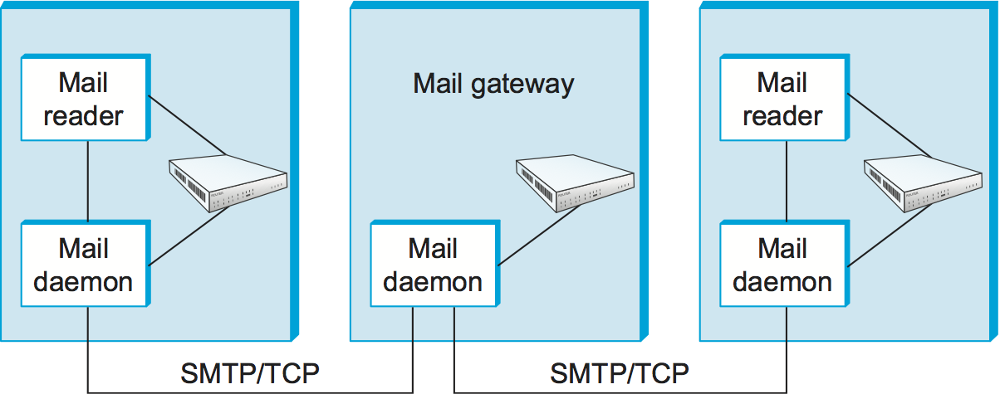
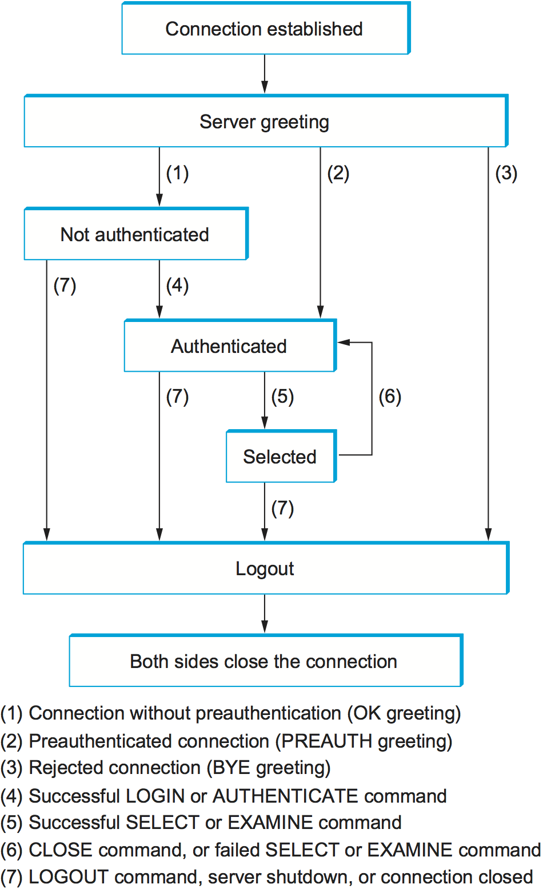
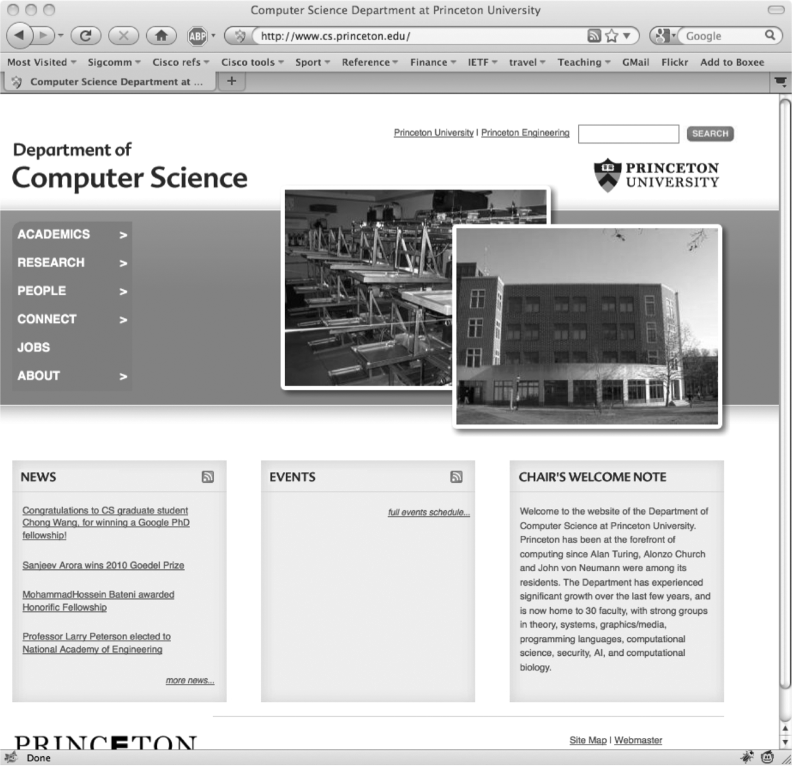
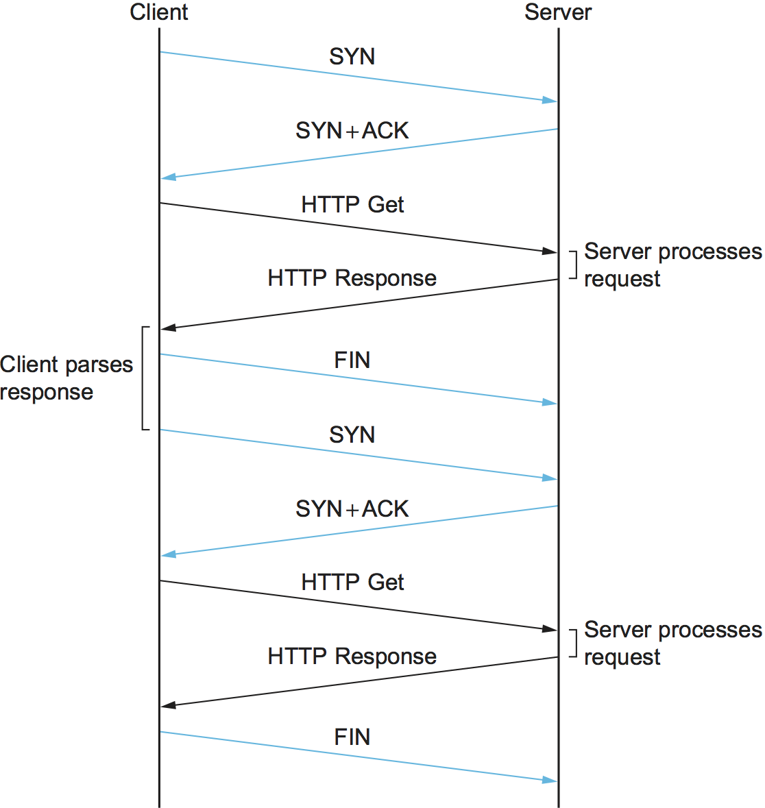
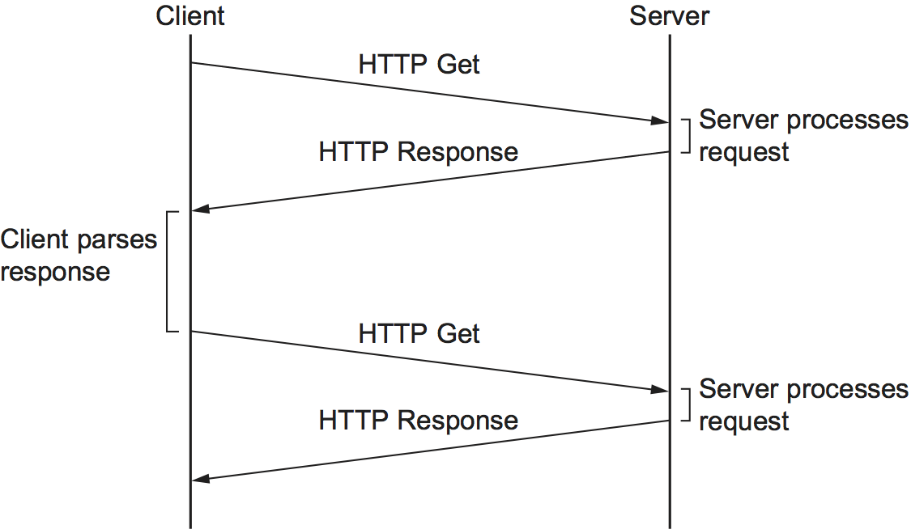

# {{Paj.Toe}}

我们开始讨论的应用程序集中在两个最受欢迎的万维网和电子邮件. 广义地说,这两个应用程序都使用请求/应答范例ℴℴ用户向服务器发送请求,然后服务器相应地作出响应. 我们把这些称为"传统"应用程序,因为它们代表了从计算机网络早期就存在的那种应用程序 (虽然Web比电子邮件要新得多,但是其根源在于之前的文件传输) . 相比之下,后面的部分将研究最近才变得可行的一类应用程序: 流式应用程序 (例如,视频和音频等多媒体应用程序) 和各种基于覆盖的应用程序.  (注意,这些类之间有一点模糊,因为您当然可以通过Web访问流式多媒体数据,但是现在我们将重点介绍Web请求页面ㄡ图像等的一般用法) . 

在仔细研究这些应用程序之前,我们需要做三个要点. 首先是区分应用程序是很重要的. *程序*及应用*协议*. 例如,超文本传输协议 (HTTP) 是用于从远程服务器检索网页的应用程序协议. 许多不同的应用程序ℴℴ即像Internet ExplorerㄡChromeㄡFirefox和Safari这样的web客户端ℴℴ为用户提供了不同的外观和感觉,但是它们都使用相同的HTTP协议通过Internet与Web服务器进行通信. 事实上,协议被发布和标准化使得许多不同的公司和个人开发的应用程序能够互操作. 这就是这么多浏览器能够与所有的Web服务器 (其中也有很多种类) 互操作的方式. 

本节着眼于两个非常广泛使用的标准化应用协议: 

-   简单邮件传输协议 (SMTP) 用于交换电子邮件. 

-   超文本传输协议 (HTTP) 用于Web浏览器和Web服务器之间的通信. 

我们还将研究自定义应用协议是如何定义的. *Web服务*建筑学. 

第二点是,由于本节中描述的应用程序协议遵循相同的请求/应答通信模式,所以您可能预期它们将构建在远程过程调用 (RPC) 传输协议的顶部. 然而,情况并非如此,因为它们是在TCP之上实现的. 实际上,每个协议在可靠传输协议 (TCP) 之上重新生成简单的RPC类机制. 我们之所以说"简单",是因为每个协议不是设计成支持前面章节中讨论的那种任意远程过程调用的,而是设计成发送和响应一组特定的请求消息. 

最后,我们观察到许多应用层协议,包括HTTP和SMTP,都有一个指定可交换的数据格式的伴随协议. 这是这些协议相对简单的一个原因: 在这个伴随文档中管理了大量的复杂性. 例如,SMTP是用于交换电子邮件消息的协议,但是RFC 822和多用途因特网邮件扩展 (MIME) 定义了电子邮件消息的格式. 类似地,HTTP是用于获取Web页面的协议,但是超文本标记语言 (HTML) 是定义这些页面的基本形式的配套规范. 

## 电子邮件 (SMTPㄡMIMEㄡIMAP) 

电子邮件是最古老的网络应用之一. 毕竟,还有什么比在刚刚运行的跨国链接的另一端向用户发送消息更自然的呢?令人惊讶的是,ARPANET的先驱们在创建网络时并没有真正将电子邮件设想为一个关键应用ℴℴ对计算资源的远程访问是主要的设计目标ℴℴ但是它被证明是一个非常有用的应用,并且继续非常流行. 

如上所述,重要的是(1)将用户界面(即,邮件阅读器)与基础消息传输协议(例如,SMTP或IMAP)区分开,(2)将此传输协议与定义me格式的伴随协议(RFC 822和MIME)区分开. 圣殿正在交换. 我们从查看消息格式开始. 

### 报文格式

RFC 822定义消息有两个部分: *页眉*和A*身体*. 这两个部分都用ASCII文本表示. 最初,身体被假定为简单的文本. 这仍然是这样的,尽管RFC 822已被MIME扩充,以允许消息体承载各种数据. 这个数据仍然表示为ASCII文本,但是因为它可能是JPEG图像的编码版本,所以不一定由人类用户读取. 更多关于MIME的片刻. 

消息头是一系列<CRLF>-终止线.  (<CRLF>表示回车加换行,这是一对ASCII控制字符,通常用于指示一行文本的结尾. ) 标题与消息正文之间用空行分隔. 每个标题行包含由冒号分隔的类型和值. 这些标题中的许多对用户来说都很熟悉,因为它们被要求在撰写电子邮件消息时填写它们;例如,标题标识消息接收者,并且标题说明消息的目的. 其他邮件头由底层邮件传送系统填写. 示例包括 (当消息被传输时) ㄡ (用户发送了什么消息) 和 (处理此消息的每个邮件服务器) . 当然,还有许多其他标题行;感兴趣的读者被引用到RFC 822. 

RFC 822在1993年进行了扩展 (此后进行了多次更新) ,以允许电子邮件消息携带许多不同类型的数据: 音频ㄡ视频ㄡ图像ㄡPDF文档等等. MIME由三个基本组成部分组成. 第一个片段是增强由RFC 822定义的原始集合的标题行的集合. 这些标题行以各种方式描述消息体中携带的数据. 它们包括 (正在使用的MIME版本) , (与行类似的消息中的内容的人类可读描述) , (消息中包含的数据类型) ,以及 (消息体中的数据是如何编码的) . 

第二部分是一组内容类型 (和子类型) 的定义. 例如,MIME定义了两种不同的静止图像类型,它们都具有明显的含义. 作为另一个示例,引用在香草822样式的消息中可能找到的简单文本,同时表示包含"标记的"文本 (使用特殊字体ㄡ斜体等的文本) 的消息. 作为第三个例子,MIME定义了`application`类型,其中子类型对应于不同应用程序的输出 (例如,`application/postscript`和`application/msword`) 

MIME还定义了`multipart`类型,它表示如何承载承载多个数据类型的消息. 这就像定义基类型 (例如,整数和浮点数) 和复合类型 (例如,结构和数组) 的编程语言. 一种可能`multipart`子类型是`mixed`,该消息表示该消息包含一组独立的数据块. 每一个片段都有自己的标题行来描述该部分的类型. 

第三部分是对各种数据类型进行编码的方式,因此它们可以以ASCII电子邮件的形式发送. 问题是,对于一些数据类型 (例如,JPEG图像) ,图像中任何给定的8位字节可能包含256个不同值之一. 这些值中只有一个子集是有效的ASCII字符. 电子邮件消息仅包含ASCII很重要,因为它们可能会通过许多中间系统 (网关,如下所述) ,这些系统假定所有电子邮件都是ASCII,如果包含非ASCII字符,则会破坏消息. 为了解决这个问题,MIME使用二进制数据到ASCII字符集的直接编码. 编码被称为编码. `base64`. 其思想是将原始二进制数据中的每三字节映射为四个ASCII字符. 这是通过将二进制数据分组为24位单元并将每个单元分成四个6位单元来完成的. 每个6位块映射到64个有效的ASCII字符中的一个;例如,0个映射映射到一个1个映射到B上,等等. 如果查看使用base64编码方案编码的消息,您将只注意到52个大写字母和小写字母ㄡ10位数字0到9以及特殊字符+和/. 这些是ASCII字符集中的前64个值. 

一方面,为了让那些仍然坚持使用纯文本邮件阅读器的人阅读邮件时尽可能地轻松,可以使用7位ASCII对由普通文本组成的MIME消息进行编码. 对于大多数ASCII数据也有可读编码. 

综上所述,包含一些纯文本ㄡJPEG图像和PostScript文件的消息将如下所示: 

```pseudo
MIME-Version: 1.0
Content-Type: multipart/mixed;
boundary="-------417CA6E2DE4ABCAFBC5"
From: Alice Smith <Alice@cisco.com>
To: Bob@cs.Princeton.edu
Subject: promised material
Date: Mon, 07 Sep 1998 19:45:19 -0400

---------417CA6E2DE4ABCAFBC5
Content-Type: text/plain; charset=us-ascii
Content-Transfer-Encoding: 7bit

Bob,

Here's the jpeg image and draft report I promised.

--Alice

---------417CA6E2DE4ABCAFBC5
Content-Type: image/jpeg
Content-Transfer-Encoding: base64
... unreadable encoding of a jpeg figure
---------417CA6E2DE4ABCAFBC5
Content-Type: application/postscript; name="draft.ps"
Content-Transfer-Encoding: 7bit
... readable encoding of a PostScript document
```

在这个示例中,消息头中的行表示该消息包含各种片段,每个片段由在数据本身中不出现的字符串表示. 每一片都有自己的线条. 

### 转报

多年来,大多数电子邮件只使用SMTP从主机移动到主机. 虽然SMTP继续扮演一个中心角色,但它现在只是几个电子邮件协议的一个,因特网消息访问协议 (IMAP) 和邮局协议 (POP) 是用于检索邮件消息的另外两个重要协议. 我们将从SMTP开始讨论,然后转到下面的IMAP. 

要将SMTP放置在正确的上下文中,我们需要识别关键的参与者. 首先,用户与*邮件阅读器*当他们组成,文件,搜索,阅读他们的电子邮件. 无数的邮件阅读器是可用的,就像有很多Web浏览器可以选择一样. 在互联网的早期,用户通常登录到他们的机器上. *信箱*驻留,他们调用的邮件阅读器是从文件系统中提取消息的本地应用程序. 当然,今天,用户从笔记本电脑或智能手机远程访问邮箱;他们不会首先登录到存储邮件的主机 (邮件服务器) . 第二邮件传输协议,如POP或IMAP,用于远程地从邮件服务器下载电子邮件到用户的设备. 

第二,有一个*邮件守护进程* (或进程) 在持有邮箱的每个主机上运行. 你可以想到这个过程,也称为*消息传送代理* (MTA) 作为邮局的角色: 用户 (或他们的邮件阅读器) 将希望发送给其他用户的守护进程消息交给其他用户,守护进程使用通过TCP运行的SMTP将消息发送给在另一台机器上运行的守护进程,并且守护进程将传入的消息放入用户的邮箱 (该用户的邮件阅读器可以在以后找到它们. 由于SMTP是任何人都可以实现的协议,理论上可以有许多不同的邮件守护进程的实现. 然而,事实证明,只有少数几个流行的实现方式和旧的. `sendmail`来自伯克利UNIX的程序`postfix`是最普遍的. 

<figure class="line">
	<a id="mail"></a>
	
	<figcaption>Sequence of mail gateways store and forward email
	messages.</figcaption>
</figure>

虽然发送方机器上的MTA肯定有可能建立到接收方邮件服务器上的MTA的SMTP/TCP连接,但在许多情况下,邮件会遍历一个或多个*邮件网关*从发送方主机到接收方主机的路由. 与终端主机一样,这些网关也运行消息传递代理进程. 这些中间节点被称为一个偶然事件. *网关*因为他们的工作是存储和转发电子邮件,就像一个"IP网关" (我们称之为一个IP网关) . *路由器*) 存储和转发IP数据报. 唯一的区别在于,邮件网关通常将消息缓冲在磁盘上,并且愿意尝试将消息重传到下一台机器几天,而IP路由器将数据报缓冲在内存中,并且只愿意重传几秒钟. [图1](#mail)说明从发送方到接收方的两跳路径. 

你可能会问,为什么邮件网关是必要的?为什么发送者的主机不能将消息发送到接收方的主机?一个原因是接收者不希望包括他或她在他或她的地址上阅读电子邮件的特定主机. 另一个是规模: 在大型组织中,通常情况下,许多不同的机器持有. *邮箱*为了组织. 例如,传递给Bob的邮件首先被发送到普林斯顿CS部门的邮件网关 (即,发送到命名的主机) ,然后被转发 (涉及第二个连接) 到Bob有邮箱的特定机器. 转发网关维护一个数据库,该数据库将用户映射到他们的邮箱所在的机器上;发送方不需要知道这个特定的名称.  (消息中的标题行列表将帮助您跟踪给定消息所穿越的邮件网关. ) 另一个原因,尤其是在电子邮件的早期阶段,是托管任何给定用户邮箱的机器可能不总是处于启动状态或可访问状态,在这种情况下,邮件网关保存消息直到它可以被传递. 

独立于路径中的邮件网关数量,在每个主机之间使用独立的SMTP连接来将消息移动到更靠近接收方的位置. 每个SMTP会话都涉及两个邮件守护进程之间的对话,一个充当客户端,另一个充当服务器. 在一个会话中,多个消息可以在两个主机之间传输. 由于RFC 822使用ASCII作为基本表示来定义消息,所以了解到SMTP也是基于ASCII的消息也就不足为奇了. 这意味着键盘上的人可以假装为SMTP客户端程序. 

SMTP最好通过一个简单的例子来理解. 下面是发送主机和接收主机之间的一种交换. 在这种情况下,用户鲍伯在普林斯顿试图发送邮件给用户爱丽丝和汤姆在思科. 发送的线路用黑色显示,发送的线路在TEAL中显示. 额外的空白行已被添加,使对话框更可读. 

```shell
HELO cs.princeton.edu
250 Hello daemon@mail.cs.princeton.edu [128.12.169.24]

MAIL FROM:<Bob@cs.princeton.edu>
250 OK

RCPT TO:<Alice@cisco.com>
250 OK

RCPT TO:<Tom@cisco.com>
550 No such user here

DATA
354 Start mail input; end with <CRLF>.<CRLF>
Blah blah blah...
...etc. etc. etc.
<CRLF>.<CRLF>
250 OK

QUIT
221 Closing connection
```

正如您所看到的,SMTP涉及客户机与服务器之间的一系列交换. 在每个交换中,客户端发布命令 (例如,`QUIT`并且服务器用代码响应 (例如,`221`) 服务器还给代码返回一个人类可读的解释 (例如,) . 在这个特定的示例中,客户端首先用`HELO`命令. 它给出了它的域名作为参数. 服务器验证这个名称与TCP连接使用的IP地址相对应;您将注意到服务器向客户端声明了这个IP地址. 然后,客户端询问服务器是否愿意接受两个不同用户的邮件;服务器通过向一个用户说"是"和对另一个用户说"否"来响应. 然后客户端发送消息,该消息由一行上的一个周期 (".") 终止. 最后,客户端终止连接. 

当然,还有许多其他的命令和返回代码. 例如,服务器可以响应客户端的`RCPT`用A命令`251`代码,它指示用户在该主机上没有邮箱,但是服务器承诺将消息转发到另一个邮件守护进程. 换句话说,主机充当邮件网关. 作为另一个示例,客户端可以发布`VRFY`操作以验证用户的电子邮件地址,但实际上不向用户发送消息. 

唯一感兴趣的另一点是`MAIL`和`RCPT`操作;例如,和,分别. 这些看起来很像822个头字段,从某种意义上说,它们是. 实际情况是邮件守护进程解析消息以提取运行SMTP所需的信息. 它提取的信息被称为*信封*为了这个消息. SMTP客户端使用此信封来参数化其与SMTP服务器的交换. 一个历史注解: 原因`sendmail`变得如此流行的是没有人想要重新实现这个消息解析功能. 虽然今天的电子邮件地址看起来相当温和 (例如) ,但情况并非总是如此. 在每个人都连接到互联网之前的日子里,看到表单的电子邮件地址并不少见. 

### 邮件阅读器

最后一步是让用户实际从邮箱中检索他或她的消息,读取它们,回复它们,并且可能保存一个副本以供将来参考. 用户通过与邮件阅读器交互来执行所有这些操作. 正如前面指出的,这个阅读器最初只是一个运行在用户邮箱的同一台机器上的程序,在这种情况下,它可以简单地读写实现邮箱的文件. 这是笔记本电脑时代的常见情况. 现在,大多数情况下,用户使用另一个协议 (例如POP或IMAP) 从远程机器访问他或她的邮箱. 讨论邮件阅读器的用户界面方面超出了本书的范围,但是讨论访问协议绝对超出了我们的范围. 我们特别考虑IMAP. 

IMAP在很多方面与SMTP相似. 它是通过TCP运行的客户端/服务器协议,其中客户端 (在用户的桌面机器上运行) 以终止的ASCII文本行的形式发出命令,邮件服务器 (在维护用户邮箱的机器上运行) 以实物作出响应. 交换开始于客户端认证他或她自己,并识别他或她想要访问的邮箱. 这可以用简单的状态转换图来表示. [图2](#imap). 在这个图中,以及`LOGOUT`是客户端可以发出的示例命令,而`OK`是一个可能的服务器响应. 其他常见命令包括`EXPUNGE`具有明显的意义. 其他服务器响应包括`NO` (客户端没有执行该操作的权限) `BAD` (命令不健全) . 

<figure class="line">
	<a id="imap"></a>
	
	<figcaption>IMAP state transition diagram.</figcaption>
</figure>

当用户要求`FETCH`一个消息,服务器以MIME格式返回它,邮件阅读器解码它. 除了消息本身之外,IMAP还定义了一组消息. *属性*作为其他命令的一部分交换,独立于传递消息本身. 消息属性包括消息大小等信息,更有趣的是,*旗帜*与消息相关联 (例如) `Recent`) 这些标志用于保持客户机和服务器的同步;也就是说,当用户删除邮件阅读器中的消息时,客户机需要向邮件服务器报告这一事实. 稍后,如果用户决定删除所有已删除的消息,则客户端发出`EXPUNGE`对服务器的命令,该服务器知道实际删除邮箱中所有较早的已删除消息. 

最后,请注意,当用户回复消息或发送新消息时,邮件阅读器不会使用IMAP将消息从客户端转发到邮件服务器,而是使用SMTP. 这意味着用户的邮件服务器实际上是沿着从桌面到收件人邮箱的路径遍历的第一个邮件网关. 

## 万维网 (HTTP) 

万维网已经非常成功,并且使得许多人能够访问互联网,有时它似乎与互联网是同义词. 事实上,成为Web的系统的设计始于1989年左右,远在因特网成为广泛部署的系统之后. Web的最初目标是找到一种组织和检索信息的方法,利用关于超文本链接文档的思想,这种思想至少从20世纪60年代就已经存在. CUTE语言 (HTML) 是为了达到这个目的而设计的. 

> 万维网财团提供的万维网的简短历史可以追溯到1945年一篇描述缩微胶片文档之间链接的文章. 

一个有用的方法来思考Web是一组合作的客户机和服务器,他们都说同一种语言: http. 大多数人通过图形客户端程序或Web浏览器 (如SafariㄡChromeㄡFirefox或Internet Explorer) 接触Web. [图3](#netscape)显示了Firefox浏览器在使用,显示一页信息从普林斯顿大学. 

<figure class="line">
	<a id="netscape"></a>
	
	<figcaption>The Firefox web browser.</figcaption>
</figure>

显然,如果希望将信息组织到链接的文档或对象系统中,则需要能够检索一个文档才能开始. 因此,任何Web浏览器都具有允许用户通过打开URL获得对象的功能. 统一资源定位器 (URL) 对于我们大多数人来说已经很熟悉了,以至于很容易忘记它们并不是永远存在的. 它们提供允许Web上的对象定位的信息,它们看起来如下: 

```html
http://www.cs.princeton.edu/index.html
```

如果打开那个特定的URL,您的Web浏览器将在调用的机器上打开到Web服务器的TCP连接,并立即检索并显示调用的文件. Web上的大多数文件包含图像和文本,并且许多文件还有其他对象,如音频和视频剪辑ㄡ代码片段等. 它们还经常包括指向其他机器上的其他文件的URL,这些文件是HTTP和HTML的"超文本"部分的核心. 网络浏览器有某种方式可以识别URL (通常通过突出显示或下划线) ,然后你可以要求浏览器打开它们. 这些嵌入式URL被称为*超文本链接*. 当你要求你的网络浏览器打开这些嵌入的URL之一 (例如,通过鼠标指向和点击它) ,它会打开一个新的连接,并检索和显示一个新的文件. 这叫做*跟踪链接*. 因此,在各种信息的链接之后,从一台机器跳到另一台机器变得非常容易. 一旦您有了在文档中嵌入链接并允许用户跟随该链接来获取另一个文档的方法,您就拥有了超文本系统的基础. 

当您要求浏览器查看页面时,浏览器 (客户端) 使用在TCP上运行的HTTP从服务器获取页面. 与SMTP一样,HTTP是面向文本的协议. HTTP是其核心,请求/响应协议,其中每个消息都具有一般形式. 

```pseudo
START_LINE <CRLF>
MESSAGE_HEADER <CRLF>
<CRLF>
MESSAGE_BODY <CRLF>
```

在那里,和以前一样`<CRLF>`代表回车+直线进给. 第一行 (第一行) `START_LINE`) 指示这是请求消息还是响应消息. 实际上,它标识要执行的"远程过程" (在请求消息的情况下) ,或者*地位*请求 (在响应消息的情况下) . 下一行指定指定请求或响应的选项和参数集合. 其中有零个或更多个`MESSAGE_HEADER`行的集合由一条空白行终止,每个行看起来像电子邮件中的标题行. HTTP定义了许多可能的报头类型,其中一些与请求消息有关,一些与响应消息有关,还有一些与消息体中携带的数据有关. 尽管我们给出了一组完整的可能的报头类型,但我们只举了几个代表性的例子. 最后,在空白行到达所请求的消息的内容之后 (`MESSAGE_BODY`消息的这部分是服务器在响应请求时放置所请求页面的位置,并且请求消息通常为空. 

HTTP为什么要运行TCP?设计人员不必那样做,但是TCP确实提供了与HTTP需要的相当好的匹配,特别是通过提供可靠的传递 (谁想要一个丢失数据的网页?) ㄡ流量控制和拥塞控制. 然而,正如我们将在下面看到的,在TCP之上构建请求/响应协议会产生一些问题,特别是如果您忽略了应用程序和传输层协议之间交互的微妙之处. 

### 请求消息

HTTP请求消息的第一行指定了三件事: 要执行的操作ㄡ应该在Web页面上执行操作以及使用的HTTP版本. 虽然HTTP定义了各种可能的请求操作,包括*写*允许网页张贴在服务器上的操作这两种最常见的操作是`GET` (获取指定的网页) 和`HEAD` (获取指定网页的状态信息) . 前者显然是在浏览器想要检索和显示网页时使用的. 后者用于测试超文本链接的有效性,或者查看自浏览器上次获取特定页面以来是否对其进行了修改. 全套操作总结如下[表1](#ops). 听上去像是天真无邪`POST`命令可以在互联网上造成很多恶意 (包括垃圾邮件) . 

<a id="ops"></a>

|  操作 | 描述              |
| --: | :-------------- |
|  选项 | 请求有关可用选项的信息     |
|  得到 | 检索URL中标识的文档     |
|   头 | 检索URL中识别的文档元信息  |
|   柱 | 向服务器提供信息 (如注释)  |
|   放 | 在指定的URL下存储文档    |
|  删除 | 删除指定的URL        |
|  痕迹 | 回送请求消息          |
|  连接 | 代理使用            |

*表1. HTTP请求操作. *

例如,`START_LINE`

```http
GET http://www.cs.princeton.edu/index.html
HTTP/1.1
```

称客户端希望宿主上的服务器返回命名的页面. 这个特殊的例子使用了*绝对的*网址. 也可以使用*相对的*标识符并在其中一个指定主机名`MESSAGE_HEADER`举例来说,

```http
GET index.html HTTP/1.1
Host: www.cs.princeton.edu
```

在这里,`Host`是可能的之一`MESSAGE_HEADER`领域. 其中更有趣的一点是,它为客户端提供了一种有条件地请求网页的方法ℴℴ服务器只在页面从标题行中指定的时间起被修改时才返回该页面. 

### 响应消息

像请求消息一样,响应消息从单个消息开始. `START_LINE`. 在这种情况下,该行指定正在使用的HTTP的版本ㄡ指示请求是否成功的三位数的代码以及给出响应原因的文本字符串. 例如,`START_LINE`

```http
HTTP/1.1 202 Accepted
```

指示服务器能够满足请求,而

```http
HTTP/1.1 404 Not Found
```

指示无法满足请求,因为找不到页面. 有五种通用类型的响应代码,代码的第一位表示其类型. [表2](#codes)总结了五种类型的代码. 

<a id="codes"></a>

|  代码 |   类型  | 实例原因             |
| :-: | :---: | :--------------- |
| 1xx |  信息化的 | 请求接收,继续过程        |
| 2xx |   成功  | 成功接收ㄡ理解和接受的行动    |
| 3xx |  重定向  | 必须采取进一步行动来完成请求.  |
| 4xx | 客户端错误 | 请求包含语法错误或无法实现    |
| 5xx | 服务器错误 | 服务器未能满足明显有效的请求   |

*表2. HTTP结果代码的五种类型. *

正如意外的后果`POST`请求消息,有时在实践中如何使用各种响应消息是令人惊讶的. 例如,请求重定向 (特别是代码302) 原来是一个强大的机制,通过将请求重定向到附近的缓存,它在内容分发网络 (CDN) 中扮演着重要角色. 

响应消息也类似于请求消息,可以包含一个或多个响应消息. `MESSAGE_HEADER`线. 这些线路将附加信息中继回客户端. 例如,`Location`标题行指定请求的URL在另一个位置可用. 因此,如果普林斯顿CS Department Web页面已经从,例如,移动到了,那么原始地址的服务器可能会响应

```http
HTTP/1.1 301 Moved Permanently
Location: http://www.princeton.edu/cs/index.html
```

在一般情况下,响应消息也将携带所请求的页面. 这个页面是一个HTML文档,但是由于它可能携带非文本数据 (例如,GIF图像) ,所以使用MIME对其进行编码 (参见前面的部分) . 一定的`MESSAGE_HEADER`线条给出页面内容的属性,包括 (内容中的字节数) ,`Expires` (内容被认为过时的时间) 和 (在服务器上最后修改内容的时间) . 

### 统一资源标识

HTTP作为地址使用的URL是一种类型的*统一资源标识符* (URI) . URI是标识资源的字符串,其中资源可以是具有标识的任何东西,例如文档ㄡ图像或服务. 

URI的格式允许各种更专门的资源标识符被合并到标识符的URI空间中. URI的第一部分是*方案*这是一种识别某种资源的特殊方式,例如`mailto`对于电子邮件地址或`file`用于文件名. URI的第二部分,由冒号与第一部分分开,是*方案特定部分*. 它是与第一部分中的方案一致的资源标识符,如URI中的. `mailto:santa@northpole.org`和`file:///C:/foo.html`.

资源不必是可检索或可访问的. 我们在前面的章节中看到了一个例子ℴℴ可扩展标记语言 (XML) 名称空间由看起来非常像URL的URI标识,但严格地说,它们不是*定位器*因为它们没有告诉你如何定位某些东西,它们只是为命名空间提供了一个全局唯一的标识符. 不需要在URL中检索任何作为XML文档的目标命名空间的任何东西. 我们将看到URI的另一个例子,URI不是后面的一个URL

### 最大并发连接

HTTP (1) 的原始版本为从服务器检索的每个数据项建立了一个单独的TCP连接. 不难看出这是一个非常低效的机制: 连接设置和拆卸消息必须在客户机和服务器之间交换,即使客户机想做的只是验证它具有页面的最新副本. 因此,检索包含一些文本ㄡ十几个图标或其他小图形的页面将导致建立和关闭13个单独的TCP连接. [图4](#oldhttp)显示用于获取具有单个嵌入对象的页面的事件序列. 彩色线表示TCP消息,而黑线表示HTTP请求和响应.  (一些TCPACK没有显示以避免混乱图片. ) 您可以看到两个往返时间用于设置TCP连接,而另外两个 (至少) 用于获取页面和图像. 除了延迟影响之外,服务器上处理额外的TCP连接建立和终止也需要成本. 

<figure class="line">
	<a id="oldhttp"></a>
	
	<figcaption>HTTP 1.0 behavior.</figcaption>
</figure>

为了克服这种情况,引入了HTTP版本1.1. *持久连接*-客户端和服务器可以在同一TCP连接上交换多个请求/响应消息. 持久连接有很多优点. 首先,它们明显地消除了连接设置开销,从而减少了服务器上的负载ㄡ由附加TCP分组引起的网络上的负载以及用户感知到的延迟. 第二,因为客户端可以沿着单个TCP连接发送多个请求消息,所以TCP的拥塞窗口机制能够更有效地操作. 这是因为没有必要为每个页面进行慢启动阶段. [图5](#persist)显示来自[图4](#oldhttp)在连接已经打开的情况下使用持久连接 (可能是由于同一服务器的某些先前访问) . 

<figure class="line">
	<a id="persist"></a>
	
	<figcaption>HTTP 1.1 behavior with persistent connections.</figcaption>
</figure>

然而,持续的连接不是没有代价的. 问题是客户机和服务器都不知道保持特定的TCP连接打开多长时间. 这在服务器上尤其重要,服务器可能要求保持数千个客户端的连接打开. 解决方案是,如果服务器在一段时间内没有接收到连接上的请求,则服务器必须超时并关闭连接. 此外,客户端和服务器都必须查看对方是否已选择关闭连接,并且它们必须使用该信息作为它们应该关闭它们连接端的信号.  (请记住,在完全终止TCP连接之前,双方必须关闭. ) 对这种增加的复杂性的担忧可能是为什么从一开始就不使用持久连接的原因之一,但现在人们普遍认为,持久连接的好处多于抵消DRAB. 阿克斯. 

### 高速缓存

当今互联网最活跃的研究领域之一就是如何有效地缓存网页. 缓存有很多好处. 从客户机的角度来看,与必须从世界各地获取页面相比,可以从附近的缓存中检索的页面显示得更快. 从服务器的角度来看,具有高速缓存拦截和满足请求减少了服务器上的负载. 

缓存可以在许多不同的地方实现. 例如,用户的浏览器可以缓存最近访问的页面,如果用户再次访问同一页面,则只需显示缓存的副本. 作为另一个示例,站点可以支持单个站点范围的高速缓存. 这允许用户利用先前由其他用户下载的页面. 接近互联网的中间,互联网服务提供商 (ISP) 可以缓存页面. 注意,在第二种情况下,站点内的用户最有可能代表站点知道什么机器正在缓存页面,并且他们配置浏览器以直接连接到缓存主机. 这个节点有时被称为*代理*. 相反,连接到ISP的站点可能不知道ISP正在缓存页面. 简单地说,来自不同站点的HTTP请求通过一个通用的ISP路由器. 该路由器可以窥视请求消息并查看所请求页面的URL. 如果它在缓存中有页面,则返回它. 如果不是,它将请求转发到服务器,并监视响应在另一个方向上飞过. 当它完成时,路由器保存一个副本,希望它能够使用它来满足将来的请求. 

> 这类缓存有很多问题,从技术到监管. 技术挑战的一个例子是*非对称路径*当对服务器的请求和对客户端的响应不遵循相同的路由器跳数序列时. 

无论页面缓存在何处,缓存Web页面的能力都非常重要,因此HTTP被设计成使作业更容易. 诀窍在于,缓存需要确保它没有响应页面的过期版本. 例如,服务器分配到期日期 (`Expires`头字段) 将其发送回客户端 (或服务器和客户端之间的缓存) . 缓存会记住这个日期,并且知道它不需要在每次请求时重新验证页面,直到过期日期过去为止. 在该时间之后 (或者如果没有设置该头字段) ,缓存可以使用`HEAD`或有条件的`GET`操作 (`GET`用标题行来验证它是否具有页面的最新副本. 更一般地说,有一套*缓存指令*这必须遵循请求/响应链中的所有缓存机制. 这些指令指定是否可以缓存文档ㄡ可以缓存文档多长时间ㄡ文档必须有多新鲜等等. 我们将研究CDNS的相关问题,这些问题在以后的部分中是有效的分布式缓存. 

## Web服务

到目前为止,我们一直专注于人与机器之间的相互作用. 例如,人类使用网络浏览器与服务器交互,并且该交互响应于来自用户的输入而继续 (例如,通过点击链接) . 然而,对直接计算机与计算机交互的需求越来越大. 而且,正如上面描述的应用程序需要协议一样,直接相互通信的应用程序也需要协议. 本节结束时,我们将研究构建大量应用程序到应用程序协议的挑战以及一些建议的解决方案. 

使直接应用于应用通信的动机大部分来自商业世界. 在历史上,企业-企业或其他组织之间的交互涉及一些手动步骤,例如填写订单或打电话以确定某些产品是否有库存. 甚至在单个企业中,由于软件系统是独立开发的,所以在软件系统之间不能直接进行交互,因此手动步骤也很常见. 越来越多的人工交互被直接应用到应用交互中. 企业A的订单应用程序将向企业B的订单履行应用程序发送消息,该应用程序将立即响应,指示是否可以填写订单. 也许,如果订单不能由B填写,A处的申请将立即从另一个供应商订购或从供应商集合中征求投标. 

这是我们正在谈论的一个简单例子. 假设你在Amazon.com之类的在线零售商那里买了一本书. 一旦你的书已经发货,亚马逊可以在电子邮件中给你发送跟踪号码,然后你可以前往网站为船运公司-`http://www.fedex.com`也许跟踪包裹. 但是,您也可以直接从Amazon.com网站跟踪您的包. 为了实现这一点,Amazon必须能够以FedEx理解的格式向FedEx发送查询,解释结果,并在可能包含有关订单的其他信息的网页中显示结果. 在Amazon.com网页上同时提供订单的所有信息的用户体验背后隐藏着一个事实,即Amazon和FedEx必须有一个协议来交换跟踪包所需的信息ℴℴ称之为包跟踪协议. 应该清楚的是,这种类型的潜在协议太多了,所以我们最好有一些工具来简化指定和构建它们的任务. 

网络应用,甚至那些跨组织边界,不是新的电子邮件和Web浏览跨越这样的界限. 这个问题最新的是规模. 不在网络规模上进行规模化,而是在不同种类的网络应用中进行规模化. 对于电子邮件和文件传输等传统应用,协议规范和这些协议的实现通常都是由一小群网络专家开发的. 为了使大量潜在的网络应用得以快速开发,有必要提出一些简化和自动化应用协议设计和实现的任务的技术. 

两种体系结构被认为是解决这个问题的方法. 两种体系结构都被称为*Web服务*从向客户机应用程序提供远程可访问服务以形成网络应用程序的单个应用程序的术语中取名. 用于区分两种Web服务体系结构的非正式缩写术语*肥皂*和*休息* (如ㄪ肥皂与休息辩论ㄫ) . 我们将很快讨论这些术语的技术含义. 

> 名字*Web服务*不幸的是,这听起来很普通,很多人错误地认为它包含了与Web相关的任何服务. 

SOAP体系结构解决这个问题的方法是,至少在理论上,生成针对每个网络应用程序定制的协议是可行的. 该方法的关键元素是协议规范的框架ㄡ用于根据规范自动生成协议实现的软件工具包以及可跨协议重用的模块化部分规范. 

REST体系结构解决这个问题的方法是将单个Web服务视为由URI标识并通过HTTP访问的万维网资源. 本质上,REST体系结构只是Web体系结构. Web体系结构的优点包括稳定性和显示的可扩展性 (在网络规模意义上) . HTTP不适合调用远程服务的通常过程性或面向操作的风格,这可能被认为是一个缺点. 然而,REST的拥护者认为,尽管如此,仍然可以使用更面向数据或文档传递样式来公开丰富的服务,HTTP非常适合这种样式. 

尽管两种架构都被积极采用,但它们仍然足够新,以至于我们还没有关于它们真实使用的大量经验数据. 一种架构可能成为主导,或者它们可能以某种方式合并,或者我们可能发现一种架构更适合某些类型的应用程序,而另一种架构更适合其他类型的应用程序. 

### 自定义应用协议 (WSDL,SOAP) 

非正式称为SOAP的体系结构是基于*Web服务描述语言* (WSDL) 和*肥皂*. 这两个标准都是由万维网联盟 (W3C) 发布的. 这是人们通常使用的术语Web服务而没有任何预先限定符的体系结构. 由于这些标准仍在发展,我们这里的讨论实际上是一个快照. 

> 虽然名字*肥皂*起源于首字母缩略词,正式不再代表任何东西. 

WSDL和SOAP是分别指定和实现应用协议和传输协议的框架. 它们通常是一起使用的,尽管这不是严格要求的. WSDL用于指定特定于应用程序的细节,例如支持哪些操作ㄡ调用或响应这些操作的应用程序数据的格式,以及操作是否涉及响应. SOAP的作用是使定义传输协议变得容易,该传输协议具有与协议特性 (如可靠性和安全性) 完全相关的所需语义. 

WSDL和SOAP都主要由协议规范语言组成. 这两种语言都基于XML,旨在使诸如存根编译器和目录服务之类的软件工具能够访问规范. 在许多自定义协议的世界中,支持自动生成实现对于避免手动实现每个协议的工作至关重要. 支持软件通常采用第三方供应商开发的工具包和应用服务器的形式,这允许单个Web服务的开发人员更多地关注他们需要解决的业务问题 (例如跟踪客户购买的包) . 

### 定义应用协议

WSDL选择了一个过程*操作*应用协议模型. 抽象Web服务接口由一组命名操作组成,每个操作表示客户机和Web服务之间的简单交互. 操作类似于RPC系统中的远程可调用过程. W3C的WSDL底漆的一个例子是酒店预订Web服务,具有两个操作,检查可用性和MaCeServices. 

每个操作指定一个*消息交换模式* (MEP) 给出消息要传输的顺序,包括错误中断消息流时发送的故障消息. 几个MEP是预先定义的,并且可以定义新的定制MEP,但是实际上在实际使用中只有两个MEP: **仅在** (从客户机到服务的单个消息) **在外面** (客户的要求和相应的答复) . 这些模式应该是非常熟悉的,并建议支持MEP灵活性的成本可能超过利益. 

MEP是具有占位符的模板,而不是具有特定的消息类型或格式,因此操作定义的一部分涉及指定将哪些消息格式映射到模式中的占位符. 消息格式不是在我们讨论过的协议的位级别定义的. 而是将它们定义为使用XML的抽象数据模型. XMLSchema提供了一组原始数据类型和定义复合数据类型的方法. 符合XML Schema定义格式 (其抽象数据模型) 的数据可以使用XML具体表示,或者可以使用其他表示,例如"二进制"表示Fast Infoset. 

WSDL很好地分离了协议中可以被抽象指定的部分ℴℴ操作ㄡMEPㄡ抽象消息格式ℴℴ和必须是具体的部分. WSDL的具体部分指定了底层协议ㄡMEP如何映射到它,以及连接上的消息使用什么位级表示. 规范的这一部分称为*结合*,虽然它更好地描述为实现,或者映射到实现. WSDL具有针对HTTP和基于SOAP的协议的预定义绑定,这些绑定带有允许协议设计器微调到那些协议的映射的参数. 有一个定义新绑定的框架,但是SOAP协议占主导地位. 

WSDL如何减轻指定大量协议的问题的一个关键方面是通过重用本质上是规范模块的内容. Web服务的WSDL规范可以由多个WSDL文档组成,并且单个WSDL文档也可以用于其他Web服务规范. 这种模块化使得开发规范更容易,并且更容易确保,如果两个规范应该具有一些相同的元素 (例如,以便它们可以由相同的工具支持) ,那么这些元素实际上是相同的. 这种模块化以及WSDL的缺省规则还有助于防止规范对于人工协议设计者来说变得过于冗长. 

WSDL模块化对于任何开发了中等规模软件的人来说应该是熟悉的. WSDL文档不需要是一个完整的规范;它可以例如定义一个消息格式. 使用XML命名空间唯一标识了部分规范;每个WSDL文档指定了*目标名称空间*文档中的任何新定义都是在该命名空间的上下文中命名的. 一个WSDL文档可以合并另一个组件*包括*如果共享相同的目标命名空间,则第二个文档或*进口*如果目标命名空间有所不同. 

### 定义传输协议

虽然SOAP有时被称为协议,但它被更好地认为是定义协议的框架. 正如SOAP 1.2规范所解释的,"SOAP提供了一个简单的消息传递框架,其核心功能涉及提供可扩展性. "SOAP使用许多与WSDL相同的策略,包括使用XML Schema定义的消息格式ㄡ对底层协议的绑定ㄡMessage ExchaNGE模式和可重用的使用XML命名空间标识的规范元素. 

SOAP用于定义具有支持特定应用协议所需的特征的传输协议. SOAP旨在通过使用可重用组件来定义许多这样的协议是可行的. 每个组件捕获实现特定功能的头信息和逻辑. 为了定义具有特定特征集的协议,只需编写相应的组件即可. 让我们更仔细地观察肥皂的这一方面. 

SOAP 1.2介绍了*特征*抽象,规格说明如下: *SOAP功能是SOAP消息传递框架的扩展. 尽管SOAP对这些特性的潜在范围没有限制,但是示例特性可以包括"可靠性"ㄡ"安全性"ㄡ"相关性"ㄡ"路由"和消息交换模式 (MEP) ,如请求/响应ㄡ单向和对等会话. *SOAP特征规范必须包括: 

-   标识特征的URI. 

-   抽象描述的状态信息和处理,需要在每个SOAP节点实现该特征. 

-   要中继到下一个节点的信息

-    (如果特征是MEP) 交换的消息的生命周期和时间/因果关系,例如,响应跟随请求,并发送给请求的发起者

注意,协议特征概念的形式化是相当低的,它几乎是一种设计. 

给定一组特性,有两种策略来定义将实现它们的SOAP协议. 一种是分层: 将SOAP绑定到底层协议,从而获得特征. 例如,我们可以通过将SOAP绑定到HTTP来获得请求/响应协议,在HTTP请求中包含SOAP请求,在HTTP响应中包含SOAP应答. 因为这是一个常见的示例,所以SOAP具有到HTTP的预定义绑定;可以使用SOAP协议绑定框架定义新的绑定. 

实现特征的第二种更灵活的方式包括*标题块*. SOAP消息包括信封 (Envelope) 和主体 (.) ,信封包含包含报头块的报头,主体包含最终接收方的有效负载. 该消息结构在[图6](#soapFormat).

<figure class="line">
	<a id="soapFormat"></a>
	
	<figcaption>SOAP message structure.</figcaption>
</figure>

现在应该是一个熟悉的概念,某些报头信息对应于特定的特征. 数字签名用于实现认证,序列号用于可靠性,校验和用于检测消息损坏. SOAP报头块旨在封装对应于特定特征的报头信息. 这种对应并不总是一对一的,因为单个特征中可能涉及多个头部块,或者多个特征中可以使用单个头部块. 一*肥皂模块*是一个或多个标题块的语法和语义的规范. 每个模块旨在提供一个或多个特征,并且必须声明其实现的特征. 

SOAP模块背后的目标是能够通过简单地包括每个相应的模块规范来组成具有一组特性的协议. 如果协议需要最多进行一次语义和身份验证,那么在规范中包括相应的模块. 这代表了一种模块化协议服务的新方法,这是我们在本书中看到的协议分层的替代方法. 它有点像将一系列协议层变为单个协议,但以结构化的方式. 在SOAP版本1.2中引入的SOAP特性和模块在实践中如何工作还有待观察. 该方案的主要缺点是模块可能相互干扰. 需要指定一个模块规范*已知的*与其他SOAP模块的交互,但显然这对缓解问题没有多大作用. 另一方面,提供最重要的属性的核心特性和模块集可能小到足以众所周知和理解. 

### 规范Web服务协议

正如我们所说的,WSDL和SOAP不是协议;它们是标准. *指定*协议. 对于实现彼此互操作的Web服务的不同企业来说,仅仅同意使用WSDL和SOAP来定义它们的协议是不够的;它们必须同意特定于标准化的协议. 例如,您可以想象,在线零售商和航运公司可能希望按照本节开始处的简单包跟踪示例的线条,标准化用于交换信息的协议. 这种标准化对于工具支持和互操作性至关重要. 然而,该体系结构中不同的网络应用程序必须至少在它们使用的消息格式和操作方面有所不同. 

标准化和定制之间的这种张力通过建立部分标准来解决. *轮廓*. 概要文件是一组指导方针,用于缩小或限制WSDLㄡSOAP和其他标准中可用的选项,这些标准在定义协议时可以引用. 它们可以同时解决这些标准中的歧义或差距. 在实践中,配置文件通常形式化的出现. *事实上的*标准. 

最广泛和最广泛采用的剖面被称为*WS-Ⅰ基本轮廓*. 它是由行业协会Web服务互操作性组织 (WS-I) 提出的,而WSDL和SOAP是由万维网联盟 (W3C) 指定的. 基本配置文件解决了定义Web服务时所面临的一些最基本的选择. 最值得注意的是,它要求WSDL独占地绑定到SOAP,而SOAP独占地绑定到HTTP并使用HTTP POST方法. 它还指定必须使用哪些版本的WSDL和SOAP. 

这个*基本安全概要*通过指定SSL/TLS层如何使用和要求一致性来将安全约束添加到基本配置文件中. *Web 服务安全性* (Web服务安全性) . WS-Security指定如何使用各种现有技术,如X.509公钥证书和Kerberos,在SOAP协议中提供安全特性. 

2.5ptplus1pt减1ptWS-Security只是由行业协会OASIS (结构化信息标准促进组织) 建立的不断增长的SOAP级别标准套件中的第一个. 统称为*WS--*\*包括WS可靠性ㄡWS可靠性ㄡWS协调和WS原子事务. 

### 通用应用协议 (REST) 

WSDL/SOAP Web Services体系结构基于这样的假设,即跨网络集成应用程序的最佳方式是通过为每个应用程序定制的协议. 该架构被设计为使所有协议的指定和实施变得实用. 相比之下,REST Web服务体系结构基于这样的假设,即跨网络集成应用程序的最佳方法是重新应用万维网体系结构基础的模型. 这个模型,由Web架构师Roy Fielding阐述,被称为*状态迁移* (休息) . 对于Web服务,不需要新的REST体系结构ℴℴ现有的Web体系结构已经足够了,尽管可能还需要一些扩展. 在Web体系结构中,单个Web服务被视为由URI标识的资源,并通过HTTP (具有单个通用寻址方案的单个通用应用程序协议) 进行访问. 

在WSDL具有用户定义的操作的地方,REST使用可用HTTP方法的一小组,例如`GET`和`POST` (见[表1](#ops)) 那么,这些简单的方法如何提供丰富的Web服务的接口呢?通过采用REST模型,其中复杂度从协议转移到有效载荷. 有效载荷是资源抽象状态的表示. 例如,A`GET`可以返回资源的当前状态的表示,以及`POST`可以发送资源的期望状态的表示. 

资源状态的表示是抽象的;它不需要类似于特定Web服务实例如何实际实现资源. 在每个消息中不必发送完整的资源状态. 消息的大小可以通过仅传输感兴趣的状态部分 (例如,仅修改的部分) 来减小. 而且,因为Web服务与其他Web资源共享单个协议和地址空间,所以部分状态可以通过URI引用传递,即使它们是其他Web服务. 

这种方法最好概括为面向数据或文档传递方式,而不是过程风格. 在该体系结构中定义应用程序协议包括定义文档结构 (即,状态表示) . XML和较轻的JavaScript对象表示法 (JSON) 是用于这种状态的最常用的表示语言. 互操作性取决于Web服务与其客户端之间的协议,取决于状态表示. 当然,在SOAP架构中也是如此;Web服务及其客户端必须在有效载荷格式上达成一致. 不同之处在于,在SOAP体系结构中,互操作性还取决于对协议的约定;在REST体系结构中,协议总是HTTP,因此消除了互操作性问题的来源. 

REST的一个销售特性是它利用已经部署的基础设施来支持Web. 例如,Web代理可以强制安全或缓存信息. 现有的内容分发网络 (CDNS) 可用于支持REST应用程序. 

与WSDL/SOAP相比,Web有时间稳定标准并证明其规模很好. 它还带有一些安全的安全套接字层 (SSL) /传输层安全 (TLS) 的形式. 网络和休息在进化性上也有优势. 虽然WSDL和SOAP*框架*对于协议定义中可以包含哪些新特性和绑定,这种灵活性是非常灵活的,一旦定义了协议,这种灵活性就无关紧要了. 标准化协议 (如HTTP) 被设计为以向后兼容的方式扩展. HTTP自身的可扩展性采用标题ㄡ新方法和新内容类型的形式. 使用WSDL/SOAP的协议设计者需要在每个自定义协议中设计这样的可扩展性. 当然,REST体系结构中的状态表示设计者也必须为可进化性设计. 

WSDL/SOAP可能具有优势的一个领域是调整或包装先前编写的"遗留"应用程序以符合Web服务. 这是一个重要的问题,因为大多数Web服务至少在不久的将来将基于遗留应用程序. 这些应用程序通常有一个程序接口,它比休眠状态更容易地映射到WSDL的操作中. REST与WSDL/SOAP之间的竞争很可能取决于为各个Web服务设计REST样式的接口是多么容易或困难. 我们可以发现,WSDL/SOAP和其他REST更好地服务了一些Web服务. 

在线零售商Amazon.com恰好是Web服务的早期采用者 (2002) . 有趣的是,亚马逊通过*二者都*Web服务体系结构中,根据一些报告,大多数开发人员使用REST接口. 当然,这只是一个数据点,可以很好地反映Amazon特有的因素. 
